<div align="center">

# 🌲 ForestPearlEngine

**DirectX 11 기반 C++ 게임 엔진 — Actor / Component 프레임워크와 데이터 기반 레벨 구성**


-5C2D91?style=for-the-badge&logo=visualstudio&logoColor=white)

[개요](#-개요) ·
[폴더 구조](#-폴더-구조) ·
[아키텍처](#-아키텍처) ·
[메인 루프](#-엔진-메인-루프) ·
[렌더링](#-렌더링-구조) ·
[RenderPass](#render-pass) ·
[상수 버퍼](#상수-버퍼) ·
[입력](#-input-시스템) ·
[에셋](#-assets-구조) ·
[빌드](#-build-시스템) ·
[VS 설정](#visual-studio-설정) ·
[사용 가이드](#-콘텐츠-프로그래머-가이드) ·
[Demo](#-demo-프로젝트--tri_world) ·
[알려진 문제](#-알려진-문제--소멸-처리)

</div>

---

## 📖 개요

**ForestPearlEngine**은 Win32 + DirectX 11 위에 직접 구현한 C++17 게임 엔진입니다.
엔진·게임·실행기를 서로 다른 프로젝트로 분리하고, 게임 코드는 엔진이 선언한 **5개의 Hook 함수**만 구현하면 실행 파일로 패키징됩니다.

| | 핵심 기능 | 설명 |
|:-:|---|---|
| 🧩 | **Actor / Component 프레임워크** | `FPObject → FPActor → FPPawn / FPAController / FPAGameMode`, 계층형 `FPSceneComponent` 트랜스폼 |
| 🎨 | **DX11 렌더러** | `Renderer`(프레임 흐름) + `RenderingDevice`(D3D11 래퍼) 2계층, **Render List → Render Pass(Mesh / Gizmo / UI)** 구조, 슬롯 규약이 있는 **상수 버퍼 바인딩**, MSAA x4, Priority 정렬, 멀티 뷰포트 |
| 🎮 | **Input 시스템** | Raw Input(키보드·마우스) + XInput(게임패드) → Input Mapping Context → Input Action → 멤버 함수 바인딩 |
| 🕹️ | **Possess** | 컨트롤러가 Pawn을 빙의(Possess)하며, 빙의된 Pawn의 바인딩만 입력을 받음 |
| 🔩 | **Socket Attach** | StaticMesh JSON에 정의한 Socket에 컴포넌트/액터를 부착 |
| 📷 | **SpringArm + Camera** | 컨트롤러 회전을 따라가는 3인칭 카메라 |
| 📦 | **에셋 파이프라인** | FBX(ufbx) → VertexBuffer, JSON(Level / StaticMesh), 사전 컴파일 셰이더(`.vso` / `.pso`) |
| 🏭 | **클래스 레지스트리** | 문자열 이름 → 팩토리. Level JSON의 `"class"` 문자열로 액터를 생성 |
| 🛠️ | **자동 패키징** | Release\|x64 빌드 후 PowerShell 스크립트가 `<게임이름>.exe` + `Assets/`를 구성 |

---

## 📁 폴더 구조

### 최상위

```text
ForestPearlEngine/
├── ForestPearlEngine.sln          # 솔루션 (Engine / Runners / Games)
├── Build/
│   └── PackageGame.ps1            # Release 패키징 스크립트
├── Engine/
│   └── ForestPearlEngine/         # 엔진 본체 (Static Library)
├── Runners/
│   └── Runner/                    # 실행 파일 프로젝트 (main)
├── Games/
│   ├── Release_Game/              # 엔진 현재 버전과 연결되는 게임 프로젝트
│   │   ├── Tri_World/             #   ★ Demo 프로젝트 (솔루션에 포함)
│   │   ├── ShaderCode_Triangle/   #   커스텀 Material / 상수 버퍼 샘플 (이전 API 기준)
│   │   ├── Geometry_ModelSpace/
│   │   ├── SolarSystem_Ver02/
│   │   └── DX11_SetUp_Font/
│   └── Dev_Game/                  # 레거시 렌더러 시절의 학습용 프로젝트
│       ├── BaseGame/
│       ├── 05.Vertex(2D)+Face_Filling/
│       ├── DOHWA(Interface+GUID+Query)/
│       ├── DrawSolarSystem/
│       ├── HW_03_World+Rotation/
│       └── T06_Transform(I)_07_MatrixComp_(Move)_02/
├── GameTemplate/
│   ├── Readme.txt
│   └── TriWorldTemplate_Ver1.0.zip   # 새 게임 프로젝트용 템플릿
└── x64/                           # 빌드 산출물 (git 미추적)
    ├── Debug/
    └── Release/                   #   Tri_World.exe + Assets/
```

### Engine/ForestPearlEngine

```text
Engine/ForestPearlEngine/
├── ForestPearlEngine.h / .cpp        # 엔진 싱글톤: 윈도우, 메시지 펌프, 메인 루프
├── EngineLoader.h                    # 엔진 기본 에셋(Default Shader) 로드
├── GameProjectLoader.h               # 게임 프로젝트가 구현해야 하는 Hook 함수 선언
├── framework.h                       # Win32 공통 헤더
├── MCLOG.h                           # MCLOG(LogMC / WarningMC / ErrorMC) 로그 매크로
├── Base.cpp                          # 초기 콘솔 실험 코드 (빌드 제외)
│
├── FPGameInstance.h / .cpp           # GameInstance 싱글톤 + SubSystem 보관
├── FPGameInstanceSubSystem.h         # SubSystem 공통 베이스
├── FPGameTimer.h / .cpp              # [SubSystem] 고해상도 타이머 (DeltaTime)
├── FPGameProjectClassRegistry.h/.cpp # [SubSystem] 클래스 이름 → 팩토리
├── FPGameProjectSetting.h / .cpp     # [SubSystem] 윈도우/디스플레이 설정
├── FPAssetLoader.h / AssetLoader.cpp # [SubSystem] FBX · JSON · Shader 로딩
├── FPAssetManager.h / .cpp           # [SubSystem] 로딩된 에셋 보관소
├── FPMeshRenderList.h / .cpp         # [SubSystem] 메시 RenderItem 목록
├── FPGizmoRenderList.h / .cpp        # [SubSystem] 기즈모 GizmoRenderItem 목록
├── FPTextRenderList.h / .cpp         # [SubSystem] 텍스트 UIContextItem 목록
├── FPCameraList.h / .cpp             # [SubSystem] CameraItem 목록
├── FPViewPortClient.h / .cpp         # [SubSystem] 뷰포트 관리
│
├── FPWorld.h / .cpp                  # World: Level 로드, Actor 목록, GameMode
├── FPAGameMode.h / .cpp              # GameMode: Controller 생성/Tick
├── FPAController.h / .cpp            # Controller: InputComponent, Possess, ControlRotation
│
├── Object/
│   ├── Object.h                      # FPObject (Outer 체인, GetWorld)
│   ├── Actor.h / .cpp                # FPActor (RootComponent, Attach, Transform)
│   ├── FPPawn.h / .cpp               # FPPawn (Possess 대상)
│   └── Components/
│       ├── InputComponent.h / .cpp        # 입력 큐 처리 + 바인딩 호출
│       ├── InputMappingContext.h / .cpp   # Key → InputAction 매핑
│       └── InputAction.h / .cpp           # 바인딩 목록
│
├── FPActorComponent.h                # 컴포넌트 베이스 (Owner)
├── FPSceneComponent.h / .cpp         # 트랜스폼 계층 / Socket
├── FTransform.h                      # Location / Rotation / Quaternion / Scale + 행렬
├── FPPrimitiveComponent.h            # 지오메트리 컴포넌트 베이스
├── FPMeshComponent.h / .cpp          # 메시 공통 (Fill / Cull / Priority / Material)
├── FPStaticMeshComponent.h / .cpp    # StaticMesh 렌더 + Socket Transform
├── FPCameraComponent.h / .cpp        # View / Projection 계산
├── FPSpringArmComponent.h / .cpp     # 스프링 암 (EndPoint Socket)
├── GizmoComponent.h / .cpp           # 기즈모 베이스 (GizmoRenderItem 등록, Priority / Active)
├── GizmoGridComponent.h / .cpp       # Grid 라인 메시
├── GizmoAxisComponent.h / .cpp       # Axis 라인 메시
├── FPTextComponent.h / .cpp          # 2D 텍스트
├── FPMovementComponent.h / .cpp      # 이동 컴포넌트 (골격만 존재)
├── FPMovementCompoent.cpp            #   └ 빈 파일
├── InputValue.h                      # FInputValue
│
├── FPStreamableRenderAssetr.h        # 렌더 에셋 베이스
├── FPStaticMesh.h / .cpp             # StaticMesh 에셋 (VB, Socket, Material)
├── FPMaterialInterface.h             # Material 인터페이스
├── FPMaterial.h / .cpp               # 기본 Material (Default Shader)
│
├── Define/
│   ├── FPMath.h / .cpp               # Vector / Quaternion / Matrix
│   └── FPDataDefine.h / .cpp         # VERTEX, Topology, 에셋 데이터 구조체
├── Systems/
│   ├── InputSystem.h / .cpp          # [SubSystem] Raw Input + XInput
│   └── KeyStateEnum.h                # EKeyState
├── Shader/
│   └── ShaderFactory.h / .cpp        # 셰이더 로드/컴파일, InputLayout
├── Renderers/
│   ├── Renderer.h / .cpp             # Render List 생성 + Render Pass (Mesh / Gizmo / UI)
│   ├── RenderingDevice.h / .cpp      # D3D11 Device 래퍼
│   ├── FPRenderingCommon.h           # RenderItem / GizmoRenderItem / CameraItem / UIContextItem / FPViewPort + RenderingData 값 복사본
│   ├── FPConstantBufferCommon.h      # 상수 버퍼 데이터 + AddConstantBuffer / UpdateConstantBuffer
│   └── Legacy/                       # 이전 세대 렌더러 (솔루션 미포함)
│       ├── Legacy_Renderer.h / .cpp  #   FPRHI 기반 렌더러
│       ├── FPRHI/                    #   RHI 추상 인터페이스
│       ├── GDI/                      #   GDI 백엔드
│       ├── DirectX/                  #   DXRHI 백엔드
│       ├── Mia/ , MIARHI/            #   소프트웨어 렌더러 "MIA"
│       └── DOHWA/ , DOHWARHI/        #   소프트웨어 렌더러 "DOHWA(圖畵)"
├── Utility/
│   ├── FPPathManager.h / .cpp        # 에셋 경로 해석 (Debug / Release)
│   └── FPGameplayStatics.h / .cpp    # 액터 검색 유틸
├── Assets/
│   └── Shader/
│       ├── DefaultVertexShader.vsh   # 기본 VS (VS_Main)
│       ├── DefaultPixelShader.psh    # 기본 PS (PS_Main)
│       ├── DefaultShader.fx          # 참고용 (빌드 제외)
│       └── bin/                      # 빌드 시 생성: *.vso / *.pso (git 미추적)
└── Libraries/
    ├── DirectXTK/                    # SpriteBatch / SpriteFont
    ├── Ufbx/                         # FBX 로더 (ufbx.c / ufbx.h)
    └── nlohmann/                     # JSON (json.hpp)
```

### Runners/Runner

```text
Runners/Runner/
├── Main.cpp                    # main() → Runner::Run()
├── Runner.h / .cpp             # 엔진 구동 순서 호출
├── Runner.vcxproj              # Application + PackageReleaseGame 타깃
└── ReleaseGameProject.props    # GameProjectName / GameAssetDir 매크로
```

### Games/Release_Game/Tri_World

```text
Games/Release_Game/Tri_World/
├── Tri_World.vcxproj              # Static Library
├── GameProjectLoader.cpp          # ★ 엔진 Hook 함수 구현
├── GameMode.h / .cpp              # GameMode
├── GameController.h / .cpp        # 키 매핑 · Possess 전환 · 전역 토글
├── Player.h / .cpp                # Pawn (ToonLink + SpringArm + Camera)
├── Windmill.h / .cpp              # Pawn (풍차 몸체)
├── WindmillWing.h / .cpp          # Pawn (날개 1개, Socket 부착)
├── TripleWindmillWing.h / .cpp    # Pawn (날개 3단 체인)
├── TripleWingWindmill.h / .cpp    # Pawn (몸체 + 날개 3개 일체형)
├── Terrain.h / .cpp               # Actor (지형)
├── Tree.h / .cpp                  # Actor (나무)
├── Grid.h / .cpp                  # Actor (Gizmo Grid)
├── Axis.h / .cpp                  # Actor (Gizmo Axis)
├── UI.h / .cpp                    # Actor (텍스트 UI)
└── Assets/
    ├── Font/        Consolas10.sfont, 굴림9k.sfont
    ├── Level/       TriWorld.json
    ├── Model/       Terrain/ · ToonLink/ · Tree/ · Windmill/   (*.fbx)
    └── StaticMesh/  *_StaticMesh.json (6개)
```

---

## 🏛 아키텍처

### 프로젝트 의존 관계

엔진과 게임은 **Static Library**, Runner만 **Application**입니다.
엔진은 게임 코드를 모르고, 게임이 구현한 Hook 함수를 **링크 타임**에 연결합니다.

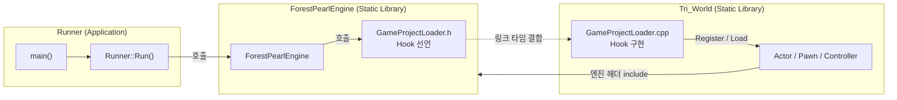

### 객체 계층

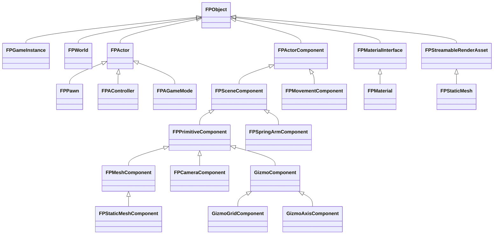

`FPObject`는 `Outer` 포인터로 소유 체인을 형성합니다 (`Actor → World → GameInstance`).
어느 객체에서든 `GetWorld()`를 호출하면 Outer를 따라 올라가 `FPWorld`를 찾습니다.

### GameInstance SubSystem

`FPGameInstance`는 싱글톤이며, 게임 실행 중 하나만 존재해야 하는 시스템 11개를 배열로 보관합니다.
접근 방법은 모두 같습니다.

```cpp
FPAssetLoader* AssetLoader =
    static_cast<FPAssetLoader*>(FPGameInstance::Get().GetAssetLoader());
```

| SubSystem | Getter | 역할 |
|---|---|---|
| `FPGameTimer` | `GetGameTimer()` | `QueryPerformanceCounter` 기반. `DeltaTime()`(초), `DeltaTimeMS()`, `TotalTime()`, `Start/Stop/Reset` |
| `FPGameProjectClassRegistry` | `GetClassRegister()` | `Register<T>("이름")`, `Create("이름")`, `HasFactory("이름")`. 이름은 **클래스 이름과 동일**해야 함 ([등록 규칙](#클래스-등록-규칙)) |
| `FPInputSystem` | `GetInputSystem()` | Raw Input / XInput 수집, 입력 큐 |
| `FPAssetManager` | `GetAssetManager()` | Mesh · VertexBuffer · StaticMesh · Level · GameMode · Shader 저장소 |
| `FPAssetLoader` | `GetAssetLoader()` | FBX / Level JSON / StaticMesh JSON / Shader 로딩 |
| `FPMeshRenderList` | `GetMeshRenderList()` | 메시 `RenderItem` 등록/해제 |
| `FPGizmoRenderList` | `GetGizmoRenderList()` | 기즈모 `GizmoRenderItem` 등록/해제 |
| `FPTextRenderList` | `GetTextRenderList()` | 텍스트 `UIContextItem` 등록/해제 |
| `FPCameraList` | `GetCameraList()` | `CameraItem` 등록/해제 |
| `FPGameProjectSetting` | `GetGameProjectSetting()` | 윈도우 클래스/타이틀, 창 크기(기본 960×600), 클라이언트 영역 크기, Aspect |
| `FPViewPortClient` | `GetViewPortClient()` | `MainGameViewPort` / `UIViewPort` / `TripleWaySplitViewPort` |

### 엔진 구성 요소 전체 목록

<details open>
<summary><b>코어 · 프레임워크</b></summary>

| 클래스 | 파일 | 설명 |
|---|---|---|
| `ForestPearlEngine` | `ForestPearlEngine.h/.cpp` | 엔진 싱글톤. 윈도우 생성, `WndProc`, 메시지 펌프, `PreInitialize / Initialize / GameLoop / Finalize`, GPU·모니터·VRAM 정보 조회 API, `SetZEnable` |
| `FPGameInstance` | `FPGameInstance.h/.cpp` | SubSystem 보관, `OpenLevel`, World 생명주기 전달 |
| `FPWorld` | `FPWorld.h/.cpp` | Level JSON으로 Actor 생성, `SpawnActor`, `GetController`, `GetAuthGameMode`, `GetGameTimer` |
| `FPAGameMode` | `FPAGameMode.h/.cpp` | `ControllerList`(클래스 이름)로 Controller 생성 후 Tick. 0번이 Player Controller |
| `FPAController` | `FPAController.h/.cpp` | `FPInputComponent` 소유, `Possess / UnPossess / GetPawn`, `AddYaw/Pitch/RollInput`(−180~180 정규화) |
| `FPObject` | `Object/Object.h` | `Outer`, `GetWorld()` |
| `FPActor` | `Object/Actor.h/.cpp` | `RootComponent`, `Initialize / BeginPlay / Tick`, `AttachToActor / AttachToComponent / DetachFromActor`, `SetRootComponent`, World Transform Get/Set |
| `FPPawn` | `Object/FPPawn.h/.cpp` | `PossessedBy / UnPossesed`, `GetController`, `AddControllerYaw/Pitch/RollInput` |
| `FPGameplayStatics` | `Utility/FPGameplayStatics.h/.cpp` | `GetActorOfClass`, `GetAllActorsOfClass`, `GetAllActors` |
| `FPPathManager` | `Utility/FPPathManager.h/.cpp` | 구성(Debug/Release)에 따른 에셋 경로, `StringToWString` |
| `MCLOG` | `MCLOG.h` | `MCLOG(LogMC, "fmt %d", v)` → `Log: [Class::Func] 메시지` |

</details>

<details open>
<summary><b>수학 · 데이터 정의</b></summary>

| 타입 | 파일 | 설명 |
|---|---|---|
| `FPVector2/3/4` | `Define/FPMath.h` | 벡터. `FPVector3`는 `+ - *`, `Length`, `Normalize` |
| `FPQuaternion` | `Define/FPMath.h` | 사원수 곱, `ToEuler`, `Normalize` |
| `FPMatrix` | `Define/FPMath.h` | `DirectX::XMMATRIX` 래퍼. `*`, `MatrixInverse`, `Transpose` |
| 함수 | `Define/FPMath.h` | `DegToRad / RadToDeg / Clamp`, `Rotate / Conjugate / Inverse / FromEuler / AngleAxis`, `NormalizeAxis`, `MatrtixTranslation / MatrixRotationQuaternion / MatrixScaling`, `MatrixLookAtLH / MatrixLookToLH / MatrixPerspectiveFovLH` |
| `FTransform` | `FTransform.h` | Location, Rotation(Euler, Degree), QuaternionRotation, Scale + 각 행렬, `Right / Up / Foraward` |
| `VERTEX` | `Define/FPDataDefine.h` | `x, y, z` + `r, g, b, a` (28 byte) |
| `Topology` | `Define/FPDataDefine.h` | `TRIANGLELIST`, `TRIANGLESTRIP`, `LINELIST` |
| 데이터 구조체 | `Define/FPDataDefine.h` | `FPMeshData`, `FPStaticMeshData`, `SOCKET_TRANSFORM`, `FPVertexBufferData`, `FPActorData` |
| `FInputValue` | `InputValue.h` | `X, Y, Z, bBool, Float` |

> 좌표계는 **왼손 좌표계, Y-Up, +Z 전방**입니다. 회전 벡터는 `{ Pitch(X), Yaw(Y), Roll(Z) }`이며 단위는 Degree입니다.

</details>

---

## 🔄 엔진 메인 루프

### 진입점

```cpp
// Runners/Runner/Runner.cpp
void Runner::Run()
{
    ForestPearlEngine& FPEngine = ForestPearlEngine::GetGameEngine();

    if (!FPEngine.PreInitialize()) return;   // 부팅
    if (!FPEngine.Initialize())    return;   // 레벨 시작
    FPEngine.GameLoop();                     // 메인 루프
    FPEngine.Finalize();                     // 종료
}
```

### 부팅 순서

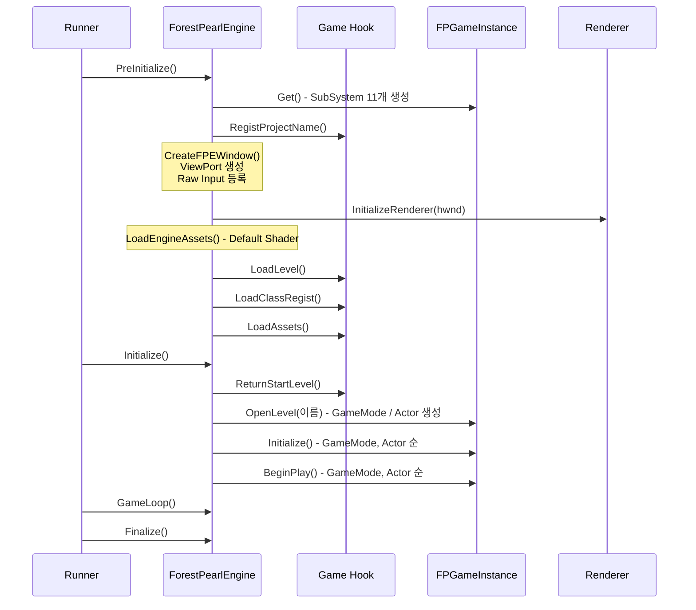

| 단계 | 함수 | 내용 |
|:-:|---|---|
| 1 | `PreInitialize()` | GameInstance 생성 → `RegistProjectName()` → 윈도우 생성 → ViewPort 생성 → Raw Input 등록 → Renderer 초기화 → 엔진 에셋 로드 → `LoadLevel()` → `LoadClassRegist()` → `LoadAssets()` |
| 2 | `Initialize()` | `OpenLevel(ReturnStartLevel())` → `World::Initialize()` → `World::BeginPlay()` |
| 3 | `GameLoop()` | 아래 프레임 루프 |
| 4 | `Finalize()` | `World::Finalize()`(Actor 삭제) → `Renderer::Finalize()` |

`FPWorld::OpenLevel`은 Level JSON의 `gamemode` 문자열로 GameMode를 만들고, `actors` 배열의 각 항목을 `ClassRegistry`로 생성해 이름과 Transform을 적용합니다.

### 프레임 루프

```cpp
// Engine/ForestPearlEngine/ForestPearlEngine.cpp
void ForestPearlEngine::GameLoop()
{
    while (bEngineLoop)
    {
        if (!MessagePump()) break;      // ① Windows 메시지

        FPGameInstance::Get().Tick();   // ② 게임 로직

        Render->CreateCamList();        // ③ Render List 생성
        Render->CreateMeshRenderList();
        Render->CreateGizmoRenderList();
        Render->CreateUIRenderList();

        Render->ClearBackBuffer();      // ④ Render Pass
        Render->MeshRenderPass();
        Render->GizmoRenderPass();
        Render->UIRenderPass();
        Render->RenderTargetPresent();
    }
}
```

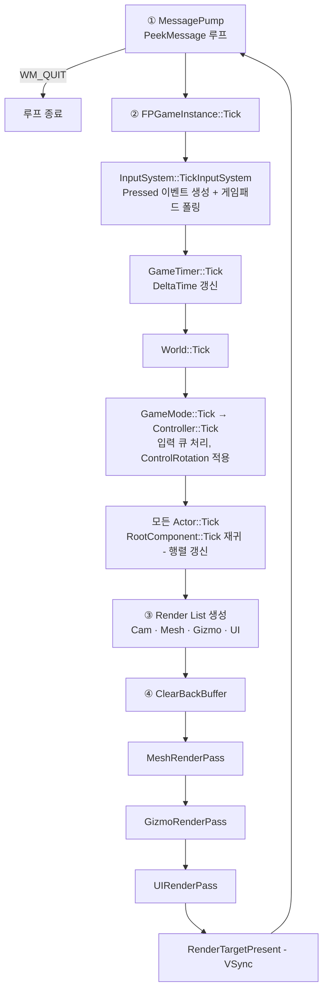

**① 메시지 펌프** — 큐가 빌 때까지 `PeekMessage`로 처리합니다. `WndProc`이 처리하는 메시지는 다음과 같습니다.

| 메시지 | 처리 |
|---|---|
| `WM_NCCREATE` | `lpCreateParams`의 엔진 포인터를 `GWLP_USERDATA`에 저장 |
| `WM_INPUT` | `FPInputSystem::HandleRawInput` |
| `WM_ACTIVATE` | `FPInputSystem::ResetKeyStates` (포커스 전환 시 키 상태 초기화) |
| `WM_SIZE` | 창 크기 갱신 → 모든 ViewPort 재계산 → `Renderer::ResizeRenderTarget` |
| `WM_DESTROY` | `PostQuitMessage(0)` |

**② 게임 로직** — 입력 → 시간 → 월드 순서로 갱신합니다. Controller가 Actor보다 먼저 Tick 되므로, 입력에 의한 이동이 같은 프레임의 행렬 계산에 반영됩니다.

**③ Render List 생성 · ④ Render Pass** — 게임 로직이 끝난 뒤 컴포넌트가 등록해 둔 목록을 값으로 복사하고, Pass 순서대로 그립니다 ([Render Pass](#render-pass) 참고).

> [!IMPORTANT]
> `FPActor::Tick()`이 `RootComponent->Tick()`을 호출해 트랜스폼 행렬을 계산합니다.
> 액터의 `Tick()`을 오버라이드할 때는 반드시 `__super::Tick()`을 호출해야 합니다.

`ForestPearlEngine::StopEngine()`을 호출하면 `bEngineLoop`가 `false`가 되어 루프가 끝납니다.

---

## 🎨 렌더링 구조

### Engine과 Renderer의 관계

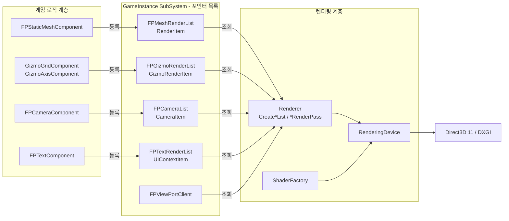

- `ForestPearlEngine`이 `Renderer`와 `RenderingDevice`(싱글톤)를 소유하고, 매 프레임 **Render List 생성 → Render Pass → Present** 순서로 호출합니다.
- **게임 코드는 D3D를 직접 호출하지 않습니다.** 컴포넌트가 생성될 때 자신의 데이터를 가리키는 **포인터 묶음**(`RenderItem` 등)을 목록에 등록하고, 소멸될 때 해제합니다.
- 등록된 항목은 컴포넌트 멤버의 **주소**를 담고 있으므로, 컴포넌트가 값을 바꾸면 별도 제출 과정 없이 다음 프레임에 반영됩니다.
- `Renderer`는 프레임마다 이 포인터 목록을 읽어 **값 복사본(스냅샷)** 인 Render List를 만들고, Render Pass는 그 복사본만 사용합니다.
- VertexBuffer, Shader, InputLayout 같은 GPU 리소스는 엔진 계층에서 `void*`로 다루고, `RenderingDevice` 내부에서만 D3D 타입으로 캐스팅합니다.

| 계층 | 클래스 | 책임 |
|---|---|---|
| 프레임 흐름 | `Renderer` | 초기화 순서, Render List 생성(스냅샷 · 정렬), Render Pass 실행, 상수 버퍼 갱신 호출, 폰트 출력, 리사이즈 |
| 디바이스 | `RenderingDevice` | Device / Context / SwapChain / RTV / DSV / State / Buffer 생성과 바인딩, 상수 버퍼 `Map` 갱신, 하드웨어 정보 |
| 셰이더 | `ShaderFactory` | `.vso` / `.pso` 로드, 런타임 컴파일, InputLayout 생성 |

### Render Pass

한 프레임의 렌더링은 **Render List 생성 → Clear → Render Pass 1 … N → Present** 로 구성됩니다.
Render Pass는 별도 클래스가 아니라 `Renderer`의 멤버 함수이며, **하나의 Pass는 하나의 Render List만 읽어 그립니다.**

```cpp
// Engine/ForestPearlEngine/ForestPearlEngine.cpp
void ForestPearlEngine::GameLoop()
{
    while (bEngineLoop)
    {
        if (!MessagePump()) break;          // ① Windows 메시지
        FPGameInstance::Get().Tick();       // ② 게임 로직

        Render->CreateCamList();            // ③ Render List 생성 (게임 로직이 끝난 뒤의 스냅샷)
        Render->CreateMeshRenderList();
        Render->CreateGizmoRenderList();
        Render->CreateUIRenderList();

        Render->ClearBackBuffer();          // ④ Render Pass
        Render->MeshRenderPass();
        Render->GizmoRenderPass();
        Render->UIRenderPass();
        Render->RenderTargetPresent();
    }
}
```

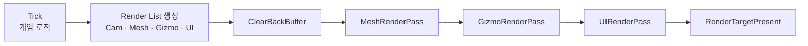

| Pass | 읽는 목록 | Topology | 반복 단위 | 상수 버퍼 | 정렬 |
|---|---|---|---|---|---|
| `MeshRenderPass` | `MeshRenderList` | `TRIANGLELIST` | 카메라 → 메시 → 뷰포트 → 서브 메시 | Object · ViewPort · Material | `Priority` 오름차순 |
| `GizmoRenderPass` | `GizmoRenderList` | `LINELIST` | 카메라 → 기즈모 → 뷰포트 → 서브 메시 | Object · ViewPort · Material | `Priority` 오름차순 |
| `UIRenderPass` | `UIRenderList` | (SpriteBatch) | 텍스트 → `UIViewPort` | 사용 안 함 | `Priority` 오름차순 |

- 모든 Pass는 시작할 때 VS / PS 상수 버퍼 14개를 바인딩합니다 ([상수 버퍼](#상수-버퍼)).
- `MeshRenderPass`와 `GizmoRenderPass`는 시작할 때 Depth Stencil State(`SetZEnable`), Rasterizer State(`SetbFill` / `SetbCull`), Topology를 지정합니다.
- Render List 생성 단계에서 **비활성(`Active = false`) 항목은 제외**됩니다. 따라서 Pass 안에서는 활성 여부를 다시 검사하지 않습니다.
- Render List는 **게임 로직(`Tick`)이 모두 끝난 시점의 값**을 복사합니다. 그려지는 값은 항상 그 프레임 `Tick`의 결과입니다.

| Render List 생성 함수 | 하는 일 |
|---|---|
| `CreateCamList` | `Active`인 카메라만 복사. `TripleCam`이면 `TripleWaySplitViewPort`, 아니면 `MainGameViewPort`를 카메라에 붙이고 ViewPort의 상수 버퍼 데이터도 함께 복사 |
| `CreateMeshRenderList` | `Active`인 `RenderItem`을 값으로 복사(Transform · 셰이더 이름 · 상수 버퍼 데이터)하고 `Priority` 오름차순 정렬 |
| `CreateGizmoRenderList` | `GizmoRenderItem`에 대해 동일 |
| `CreateUIRenderList` | `active`인 텍스트만 복사하고 `UIViewPort`를 붙인 뒤 `Priority` 오름차순 정렬 |

#### 새 Render Pass 추가 순서

1. `Renderers/FPRenderingCommon.h`에 게임 쪽 포인터 Item, `RenderingData::` 값 Item, 정렬 비교자를 추가합니다.
2. Item을 담을 목록 SubSystem을 추가합니다 (예: `FPGizmoRenderList`).
3. `Renderer`에 `CreateXxxRenderList()`와 `XxxRenderPass()`를 추가합니다.
4. `GameLoop()`에서 원하는 순서에 호출합니다. 먼저 호출된 Pass가 먼저 그려집니다.

### 렌더러에 전달되는 데이터

```cpp
// Renderers/FPRenderingCommon.h  ── 게임 → 렌더러 (포인터 묶음)
struct RenderItem            // GizmoRenderItem도 같은 구조
{
    int*  Priority;   bool* Active;
    std::string* MeshPath;                              // AssetManager의 VertexBuffer 키
    FPMatrix* Location; FPMatrix* Rotation; FPMatrix* Scale;
    std::string* VertexShaderPath; std::string* PixelShaderPath;   // Material의 셰이더 이름
    FPConstantBufferRenderData* VertexConstBuffer;      // Material의 상수 버퍼 데이터
    FPConstantBufferRenderData* PixelConstBuffer;
};

struct CameraItem            // 카메라 1개
{
    FPMatrix* Location; FPMatrix* Rotation; FPMatrix* Scale;
    FPMatrix* View;     FPMatrix* Projection;
    bool* Active;       bool* TripleCam;
};

struct UIContextItem         // 텍스트 1줄
{
    int* Priority; bool** active; int* x; int* y; FPVector4* color;
    std::basic_string<TCHAR>* msg;
};

struct FPViewPort            // 뷰포트 1개
{
    float TopLeftX, TopLeftY, Width, Height, MinDepth, MaxDepth;
    FPConstantBufferRenderData* VertexConstBuffer;      // 뷰포트 상수 버퍼 데이터
    FPConstantBufferRenderData* PixelConstBuffer;
};
```

렌더러는 위 항목을 `RenderingData::MeshRenderItem` · `GizmoRenderItem` · `CameraItem` · `UIContextItem` · `FPViewPort`로 **값 복사**해 Render List에 보관합니다.
메시 / 기즈모는 `MeshPath`로 `FPAssetManager`에서 VertexBuffer 목록을, 셰이더 이름으로 VS · PS · InputLayout을 찾아 사용합니다.

### 초기화 (`Renderer::InitializeRenderer`)

| 순서 | 호출 | 내용 |
|:-:|---|---|
| 1 | `SetDisplayMode` | 클라이언트 영역 크기, `R8G8B8A8_UNORM` |
| 2 | `CreateFactory` | `CreateDXGIFactory2` (Debug 구성은 Debug 플래그) |
| 3 | `CreateHighSpecDevice` | 어댑터를 열거해 소프트웨어 어댑터를 제외하고 **전용 VRAM이 가장 큰 GPU** 선택. Feature Level 11.1 → 11.0 |
| 4 | `CreateSwapChain` | `CreateSwapChainForHwnd`, MSAA x4, 창 모드, VSync 60Hz |
| 5 | `SetBackBufferToRenderTargetView` | BackBuffer → RenderTargetView |
| 6 | `CreateDepthStencil` | `D32_FLOAT`, MSAA x4 |
| 7 | `OMSetRenderTargets` | RTV + DSV 바인딩 |
| 8 | `GetDeviceInfo` | Feature Level 문자열, 어댑터 / 모니터 / VRAM 정보 수집 |
| 9 | `CreateSpriteBatch / CreateSpriteFont` | DirectXTK. 게임 에셋의 `Font/굴림9k.sfont` 사용 |
| 10 | `CreateDepthStencilStateCreate` | `DEPTH_ON` / `DEPTH_OFF` / `DEPTH_WRITE_OFF` |
| 11 | `RasterStateCreate` | `SOLID` / `WIREFRAME` / `CULLBACK` / `WIRECULLBACK` (CCW가 앞면) |
| 12 | `CreateVertexShaderConstBuffer(320)`<br/>`CreatePixelShaderConstBuffer(320)` | 320 byte 상수 버퍼를 **VS 14개 · PS 14개** 생성 후 `b0 ~ b13`에 바인딩 |

### 상수 버퍼

#### 구조

| 항목 | 내용 |
|---|---|
| 개수 | VS용 14개 + PS용 14개 (`b0 ~ b13`). VS와 PS의 번호 체계는 **서로 독립** |
| 크기 | 버퍼 1개당 **320 byte** 고정 (`D3D11_USAGE_DYNAMIC`, CPU Write) |
| 바인딩 | 초기화 때, 그리고 **모든 Render Pass 시작 때** 14개 전부 VS / PS에 바인딩 |
| 갱신 | `Map(WRITE_DISCARD)` → `memcpy(Buffer + Offset, Size)` → `Unmap` |
| 데이터 보관 | `FPConstantBufferRenderData` — 바이트 배열 `Buffer` + 슬롯 목록 `ConstantBuffers[]` (`{ Slot, Offset, Size }`) |

```cpp
// Renderers/FPConstantBufferCommon.h
struct FPConstantBufferInfo       { unsigned int Slot; size_t Offset; size_t Size; };
struct FPConstantBufferRenderData { std::vector<uint8_t> Buffer; std::vector<FPConstantBufferInfo> ConstantBuffers; };

namespace FPConstantBufferRenderDataUtil
{
    template<typename T> void AddConstantBuffer   (FPConstantBufferRenderData&, unsigned int Slot, const T& Data);  // 생성자에서 등록
    template<typename T> void UpdateConstantBuffer(FPConstantBufferRenderData&, unsigned int Index, const T& Data); // 값 갱신
}
```

- **Material**(`FPMaterial`)은 `VertexConstantBuffer` / `PixelConstantBuffer`를 멤버로 가지며, 메시 · 기즈모 컴포넌트가 이 주소를 `RenderItem`에 연결합니다.
- **ViewPort**(`FPViewPortClient`)도 같은 형식의 상수 버퍼 데이터를 가집니다.
- 상수 버퍼는 구조체의 **바이트 복사본**을 보관합니다. `Add`는 등록 시점의 값을, `Update`는 호출 시점의 값을 복사합니다.

#### 슬롯 규약

| 셰이더 | 레지스터 | 소유 | 내용 | 갱신 단위 |
|:-:|:-:|---|---|---|
| VS | `b0` | **엔진 예약** (Object) | `World`, `View`, `Proj`, `WV`, `WVP` (5 × 64 = 320 byte) | 오브젝트 × 뷰포트 |
| VS | `b1` | **엔진 예약** (ViewPort) | 뷰포트의 Vertex 상수. 기본 구조체 `VertexConst { AniOn, BlendOn }` | 뷰포트 |
| VS | `b2 ~ b13` | **Material** | Material의 Vertex 상수. 등록 슬롯 `k` → `b(2 + k)` | 오브젝트 |
| PS | `b0` | **엔진 예약** (ViewPort) | 뷰포트의 Pixel 상수 (`Slot k` → `b(k)`). 현재 엔진 기본 뷰포트는 사용하지 않음 | 뷰포트 |
| PS | `b1 ~ b13` | **Material** | Material의 Pixel 상수. 등록 슬롯 `k` → `b(1 + k)` | 오브젝트 |

Material이 `AddConstantBuffer`로 등록하는 `Slot`은 셰이더 레지스터 번호가 **아니라** 위 표의 "Material 영역 안에서의 상대 번호"입니다.

| Material 등록 슬롯 | 0 | 1 | 2 | … | `k` | 최댓값 |
|---|:-:|:-:|:-:|:-:|:-:|:-:|
| VS 레지스터 | `b2` | `b3` | `b4` | … | `b(2+k)` | `k = 11` → `b13` |
| PS 레지스터 | `b1` | `b2` | `b3` | … | `b(1+k)` | `k = 12` → `b13` |

> [!NOTE]
> ViewPort용 PS 상수 버퍼는 `MeshRenderPass`와 `GizmoRenderPass` 모두 `b(Slot)`으로 갱신됩니다. 따라서 PS `b0`은 ViewPort가, `b1`부터는 Material이 사용해 서로 겹치지 않습니다.
> 뷰포트 상수 버퍼는 엔진 영역이므로 게임 코드에서 추가하지 마세요. 현재 엔진 기본 뷰포트는 VS `b1`만 사용하고 PS 상수 버퍼는 등록하지 않습니다.

`World = Scale × Rotation × Location`, `WVP = World × View × Proj` 로 CPU에서 계산해 `b0`에 전달합니다. 행렬은 전치 없이 전달되므로 셰이더에서는 `mul(mWVP, pos)` 순서로 사용합니다 ([`DefaultVertexShader.vsh`](Engine/ForestPearlEngine/Assets/Shader/DefaultVertexShader.vsh) 참고).

#### 갱신 흐름

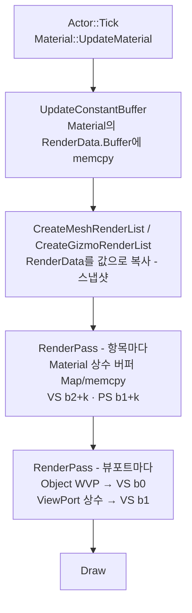

> [!NOTE]
> 엔진은 `UpdateMaterial()`을 **자동으로 호출하지 않습니다.** 값이 매 프레임 바뀌는 Material은 액터의 `Tick()`에서 직접 호출해야 합니다.

콘텐츠 프로그래머가 Material에서 상수 버퍼를 다룰 때의 규칙은 [커스텀 Material과 상수 버퍼](#8-커스텀-material과-상수-버퍼)를 참고하세요.

### 메시 · 기즈모 렌더링 (`MeshRenderPass` / `GizmoRenderPass`)

두 Pass는 Topology(`TRIANGLELIST` / `LINELIST`)와 읽는 목록만 다르고 구조가 같습니다.

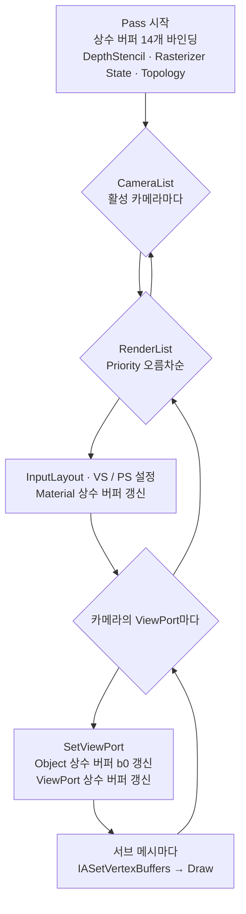

- **정렬** — `Priority` **값이 작은 항목부터** 그려집니다 (`std::sort` 오름차순). 메시 · 기즈모 컴포넌트의 `SetPriority(int)`로 지정합니다.
- **Fill / Cull** — 컴포넌트별 설정이 아니라 **Pass 전체에 적용되는 전역 값**입니다. `ForestPearlEngine::SetbFill(bool)`, `SetbCull(bool)` 조합으로 4개의 Rasterizer State 중 하나가 선택됩니다.
- **Draw** — 인덱스 버퍼 없이 `Draw(VertexCount, 0)`로 그립니다. FBX 로딩 시 삼각형 코너마다 정점을 복제합니다.
- **깊이 테스트** — `ForestPearlEngine::SetZEnable(bool)`로 전역 On/Off.
- **카메라** — 활성 카메라를 모두 순회하며, 카메라마다 Render List 전체를 다시 그립니다.
- **Material 상수 버퍼는 항목당 한 번**, **Object · ViewPort 상수 버퍼는 뷰포트마다** 갱신됩니다.

### 뷰포트 (`FPViewPortClient`)

| 이름 | 개수 | 용도 |
|---|:-:|---|
| `MainGameViewPort` | 1 | 기본 게임 화면 |
| `UIViewPort` | 1 | 텍스트 UI. 항상 클라이언트 영역 전체 |
| `TripleWaySplitViewPort` | 3 | 3분할 화면. `FPCameraComponent::OnTripleCam()`으로 전환. 뷰포트마다 다른 상수(`AniOn`, `BlendOn`)를 VS `b1`로 전달 |

게임 뷰포트는 기준 화면비(960:600)를 유지하도록 계산되며, 창의 긴 축 방향으로 분할·중앙 정렬됩니다.

### UI 렌더링 (`Renderer::UIRenderPass`)

`UIRenderList`의 텍스트마다 `SpriteBatch::Begin()` → `UIViewPort`를 설정하고 `SpriteFont::DrawString()` → `End()` 순으로 출력합니다. 상수 버퍼는 사용하지 않습니다.

### 리사이즈 (`Renderer::ResizeRenderTarget`)

`WM_SIZE` → RenderTarget 바인딩 해제 → RTV / DepthStencil 해제 → `ResizeBuffers` → RTV / DepthStencil 재생성 → 재바인딩

### 셰이더와 Material

| 항목 | 내용 |
|---|---|
| 입력 레이아웃 | `POSITION`(float3, offset 0), `COLOR`(float4, offset 12) |
| 기본 셰이더 | `DefaultVertexShader.vso`(WVP 변환, `b0`만 사용), `DefaultPixelShader.pso`(정점 색 출력, 상수 버퍼 없음) |
| 로드 방식 1 | 사전 컴파일된 오브젝트 로드 — `LoadVertexShader("X.vso", owner)` |
| 로드 방식 2 | 런타임 컴파일 — `LoadVertexShader("X.fx", "VS_Main", "vs_5_0", owner)` (행 우선 행렬 패킹) |
| `FPMaterialInterface` | `SetVertexShader / SetPixelShader`, 셰이더 이름 Getter, `Get{Vertex,Pixel}ConstantBufferRenderData()`, `UpdateMaterial(DeltaTime)` |
| `FPMaterial` | 생성 시 기본 셰이더 이름 설정. 보호 멤버 `VertexConstantBuffer` / `PixelConstantBuffer`에 `AddConstantBuffer`로 상수 버퍼를 등록 |

Material은 셰이더를 **파일 이름**(`"Demo.vso"`)으로 가리키고, 렌더러가 Pass 안에서 `FPAssetManager`에서 실제 셰이더를 찾습니다. 따라서 `LoadAssets()`에서 먼저 로드해 두어야 합니다.

Material 선택 우선순위: **컴포넌트에 `SetMaterial`로 지정한 Material** → StaticMesh JSON의 `"Material"` 클래스 → 기본 `FPMaterial`

### Legacy 렌더러

`Renderers/Legacy/`에는 DX11 렌더러 이전 단계의 구현이 보존되어 있습니다 (현재 솔루션에는 포함되지 않음).

| 폴더 | 내용 |
|---|---|
| `FPRHI/` | `FPRHI`, `FPRHIDevice`, `FPRHIVertexBuffer` 추상 인터페이스 (DX9 스타일 API) |
| `GDI/` | GDI 백엔드 |
| `DirectX/` | `DXRHI` 백엔드 |
| `Mia/`, `MIARHI/` | 소프트웨어 렌더러 MIA와 RHI 어댑터 |
| `DOHWA/`, `DOHWARHI/` | 소프트웨어 렌더러 DOHWA(圖畵署)와 RHI 어댑터 |
| `Legacy_Renderer.h/.cpp` | FPRHI를 사용하는 렌더러 |

---

## 🎮 Input 시스템

Unreal Engine의 Enhanced Input과 비슷한 **Mapping Context → Input Action → Binding** 구조입니다.

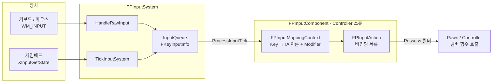

### 1. 수집 — `FPInputSystem`

| 장치 | 수집 방식 | 발생 이벤트 |
|---|---|---|
| 키보드 | `WM_INPUT` → `HandleKeyboardInput` | 상태 변화 시 `Down` / `Up`. 운영체제 키 반복 입력은 무시 |
| 키보드(누르고 있음) | `TickInputSystem` | `Pressed` 바인딩이 있는 키에 한해 매 프레임 `Pressed` 생성 |
| 마우스 | `WM_INPUT` → `HandleMouseInput` | 좌/우 버튼 `Down` · `Up`, 휠 버튼 `Down`. 값은 커서 위치를 800×600 기준 −1~1로 정규화한 `X`, `Y` |
| 게임패드 | `TickInputSystem` → `HandleGamepadInput` | 0번 컨트롤러. 버튼 `Down` / `Pressed` / `Up`, 스틱·트리거는 `Pressed` |

모든 이벤트는 하나의 구조체로 큐에 쌓입니다.

```cpp
struct FKeyInputInfo
{
    USHORT      VKey;        // 가상 키 코드 (게임패드는 0x100 이상)
    EKeyState   KeyState;    // None / Down / Pressed / Up
    FInputValue InputValue;  // X, Y, Z, bBool, Float
};
```

**게임패드 키 코드 (`XBOX_GAMEPAD`)**

| 코드 | 이름 | 값 |
|:-:|---|---|
| `0x100` | `GAMEPAD_LSTICK` | `X`, `Y` = −1 ~ 1 (데드존 0.1) |
| `0x101` | `GAMEPAD_RSTICK` | `X`, `Y` = −1 ~ 1 (데드존 0.1) |
| `0x102` ~ `0x105` | `GAMEPAD_A` / `B` / `X` / `Y` | `X` = 1 |
| `0x106` / `0x107` | `GAMEPAD_LEFT_SHOULDER` / `RIGHT_SHOULDER` | `X` = 1 |
| `0x108` / `0x109` | `GAMEPAD_START` / `BACK` | `X` = 1 |
| `0x10A` ~ `0x10D` | `GAMEPAD_DPAD_UP` / `DOWN` / `LEFT` / `RIGHT` | `X` = 1 |
| `0x10E` / `0x10F` | `GAMEPAD_LEFT_THUMB` / `RIGHT_THUMB` (스틱 클릭) | `X` = 1 |
| `0x110` / `0x111` | `GAMEPAD_LEFT_TRIGER` / `RIGHT_TRIGER` | `X` = 0 ~ 1 (임계값 초과 시) |

### 2. 매핑 — `FPInputMappingContext`

키 하나를 Input Action 이름과 Modifier에 연결합니다.

```cpp
GetInputComponent().AddMappingKey("IA_Move", 'W', { ESwizzle::YZX, ENegative::Positive });
```

| Modifier | 값 | 효과 |
|---|---|---|
| `ESwizzle` | `XYZ` | 그대로 |
| | `YZX` | `X → Y`, `Y → Z`, `Z → X` (1축 키 입력을 Y축 값으로 사용) |
| | `ZXY` | `X → Z`, `Y → X`, `Z → Y` |
| `ENegative` | `Positive` / `Negative` | `Negative`이면 값에 −1을 곱함 |

- 여러 키를 하나의 Input Action에 매핑할 수 있습니다 (예: W·A·S·D → `IA_Move`).
- **키 하나는 하나의 Input Action에만** 매핑됩니다. 같은 키를 다시 매핑하면 먼저 등록한 매핑이 유지됩니다.

### 3. 바인딩 — `FPInputAction`

```cpp
Controller->GetInputComponent().BindMethod(
    "IA_Move",            // Input Action 이름
    this,                 // 대상 객체
    EKeyState::Pressed,   // 호출 조건: Down / Pressed / Up
    &Player::Move);       // void (T::*)(FInputValue)
```

- 하나의 Input Action에 여러 객체의 함수를 바인딩할 수 있습니다.
- `Pressed`로 처음 바인딩하는 순간, 해당 Action에 매핑된 키들이 "누름 감시 목록"에 등록됩니다. **매핑(`AddMappingKey`)을 바인딩보다 먼저** 해야 합니다.

### 4. 처리 — `FPInputComponent::ProcessInputTick`

매 프레임 `FPAController::Tick()`에서 큐를 비우며 이벤트마다 다음을 수행합니다.

1. `VKey`로 Mapping Context 검색 → Input Action 이름 + Modifier
2. Input Action의 바인딩 순회
3. **Possess 필터** — 바인딩 대상이 *현재 Possess 중인 Pawn* 또는 *Controller 자신*일 때만 통과
4. `KeyState`가 바인딩의 호출 조건과 같을 때만 통과
5. Modifier(Negative → Swizzle) 적용 후 함수 호출

### 5. Possess

```cpp
Controller->Possess(Pawn);     // 이전 Pawn은 자동으로 UnPossess
Controller->UnPossess();
FPPawn* Pawn = Controller->GetPawn();
```

여러 Pawn이 같은 Input Action에 바인딩되어 있어도 **Possess 중인 Pawn만** 입력을 받습니다.
`AddControllerYawInput / PitchInput / RollInput`으로 누적한 Controller 회전은 `bUsePawnControlRotation = true`인 SpringArm이 사용합니다.

---

## 📦 Assets 구조

### 에셋 루트

에셋은 **엔진 에셋**과 **게임 에셋** 두 루트로 나뉘며, 로딩 함수의 `AssetOwner` 인자로 구분합니다.

| 구성 | 게임 에셋 루트 (`AssetOwner::User`) | 엔진 에셋 루트 (`AssetOwner::Engine`) | 컴파일된 셰이더 |
|---|---|---|---|
| Debug | `../../Games/Release_Game/<프로젝트명>/Assets` | `../../Engine/ForestPearlEngine/Assets` | `<루트>/Shader/bin/` |
| Release | `Assets` (exe 옆) | `Assets` (exe 옆) | `<루트>/Shader/` |

Debug 경로는 작업 디렉터리(`Runners/Runner`) 기준 상대 경로입니다. `<프로젝트명>`은 `FPPathManager::Get().Initialize("Tri_World")`로 지정합니다.

### 폴더 규칙

```text
Assets/
├── Font/          *.sfont               DirectXTK SpriteFont (굴림9k.sfont 필수)
├── Level/         *.json                레벨 = GameMode + Actor 배치
├── Model/         <모델>/*.fbx          원본 메시
├── StaticMesh/    *_StaticMesh.json     메시 + Topology + Socket + Material
└── Shader/        *.vsh *.psh *.fx      HLSL 소스
    └── bin/       *.vso *.pso           컴파일 결과 (빌드 시 생성)
```

| 로더 함수 | 기준 폴더 | 예 |
|---|---|---|
| `LoadFbxData(path, owner)` | `Model/` | `"Windmill/Windmill_Body.fbx"` |
| `LoadStaticMesh(name, file, owner)` | `StaticMesh/` | `"Tree_StaticMesh", "Tree_StaticMesh.json"` |
| `LoadLevelData(name, file, owner)` | `Level/` | `"TriWorld", "TriWorld.json"` |
| `LoadVertexShader(obj, owner)` / `LoadPixelShader(obj, owner)` | `Shader/bin/` (Debug) · `Shader/` (Release) | `"Demo.vso"` |
| `LoadVertexShader(src, entry, model, owner)` / `LoadPixelShader(...)` | `Shader/` | `"Demo.fx", "VS_Main", "vs_5_0"` |

### 로딩 파이프라인

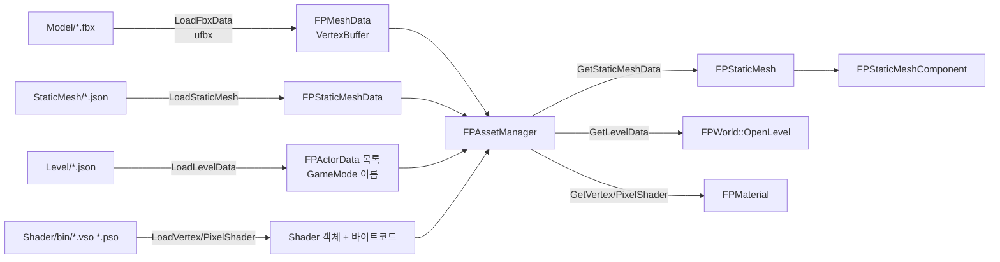

**FBX 변환 규칙** — 왼손 좌표계 · Y-Up · 미터 단위로 로드하고, 모든 면을 삼각형화한 뒤 코너마다 정점을 생성합니다. 정점에는 노드 변환이 적용된 위치와 Vertex Color가 들어가며(색이 없으면 흰색), 메시 노드 하나가 VertexBuffer 하나가 됩니다.

### Level JSON

```json
{
  "gamemode": "GameMode",
  "actors": [
    {
      "class": "Terrain",
      "name": "Ground",
      "transform": {
        "location": { "x": 0.0,   "y": -0.5, "z": 0.0 },
        "rotation": { "x": 0.0,   "y": 0.0,  "z": 0.0 },
        "scale":    { "x": 128.0, "y": 1.0,  "z": 128.0 }
      }
    }
  ]
}
```

| 키 | 설명 |
|---|---|
| `gamemode` | `ClassRegistry`에 등록한 GameMode 클래스 이름 |
| `actors[].class` | `ClassRegistry`에 등록한 Actor 클래스 이름 |
| `actors[].name` | 액터 이름 (`GetName()`으로 조회) |
| `actors[].transform` | World 기준 `location` / `rotation`(Degree) / `scale` |

### StaticMesh JSON

```json
{
  "MeshData": [
    { "Path": "Windmill/Windmill_Body.fbx", "Topology": "TRIANGLELIST" }
  ],
  "Sockets": [
    {
      "Name": "WingPoint1",
      "Transform": {
        "Location": { "x": 0.0,   "y": 3.0, "z": -1.0 },
        "Rotation": { "x": -90.0, "y": 0.0, "z": 0.0 },
        "Scale":    { "x": 1.0,   "y": 1.0, "z": 1.0 }
      }
    }
  ],
  "Material": ""
}
```

| 키 | 설명 |
|---|---|
| `MeshData[].Path` | `Model/` 기준 FBX 경로. `LoadFbxData`에 넘긴 문자열과 같아야 함 |
| `MeshData[].Topology` | `TRIANGLELIST` / `TRIANGLESTRIP` / `LINELIST` |
| `Sockets[]` | 메시 로컬 기준 부착 지점. 비워 둘 수 있음 |
| `Material` | `ClassRegistry`에 등록한 Material 클래스 이름. `""`이면 기본 Material |

---

## 🛠 Build 시스템

### 요구 사항

| 항목 | 내용 |
|---|---|
| IDE | Visual Studio 2022 (Platform Toolset **v143**) |
| 언어 표준 | C++17, Unicode |
| SDK | Windows SDK 10.0 (Direct3D 11, DXGI 1.6, XInput, D3DCompiler) |
| 구성 | `Debug` / `Release` × `x64` / `x86` |

### 솔루션 구성

| 프로젝트 | 유형 | 참조 | 비고 |
|---|---|---|---|
| `Engine/ForestPearlEngine` | Static Library | → **게임 프로젝트** | HLSL 컴파일(FxCompile) 포함 |
| `Runners/Runner` | Application (Console) | → `ForestPearlEngine` | `DirectXTK.lib` 링크, 패키징 타깃 |
| `Games/Release/Tri_World` | Static Library | — | Include 경로 `$(SolutionDir)Engine` |

빌드 순서는 **Tri_World.lib → ForestPearlEngine.lib → Runner.exe** 입니다.
엔진 프로젝트가 게임 프로젝트를 참조하므로, 게임이 구현한 Hook 함수가 최종 실행 파일에 함께 링크됩니다.

### 외부 라이브러리

| 라이브러리 | 위치 | 용도 | 연결 방식 |
|---|---|---|---|
| DirectXTK | `Libraries/DirectXTK` | `SpriteBatch`, `SpriteFont` | 헤더 `Inc/`, 라이브러리 `Bin/Desktop_2022/$(Platform)/$(Configuration)/DirectXTK.lib` |
| ufbx | `Libraries/Ufbx` | FBX 로딩 | `ufbx.c`를 엔진에 포함해 컴파일 |
| nlohmann/json | `Libraries/nlohmann` | JSON 파싱 | 헤더 전용 |

### Visual Studio 설정

프로젝트 속성은 저장소의 `.vcxproj`에 이미 들어 있습니다.
**①** 은 clone 후 PC마다 직접 해야 하는 설정이고, **② ~ ⑤** 는 새 게임 프로젝트를 만들거나 설정을 점검할 때 확인하는 항목입니다.

#### ① clone 후 직접 해야 하는 설정

`.vs/`, `*.vcxproj.user`, `**/Bin/`은 git에 포함되지 않으므로 아래 항목은 저장소에 저장되지 않습니다.

| # | 항목 | 설정 방법 |
|:-:|---|---|
| 1 | 워크로드 | Visual Studio Installer → **C++를 사용한 데스크톱 개발** (MSVC v143, Windows 10/11 SDK) |
| 2 | DirectXTK 라이브러리 | `Engine/ForestPearlEngine/Libraries/DirectXTK/DirectXTK_Desktop_2022.sln`을 열어 `Debug\|x64`, `Release\|x64`를 각각 빌드 → `Bin/Desktop_2022/x64/<구성>/DirectXTK.lib` 생성. x86으로 빌드하려면 `Win32` 구성도 빌드 |
| 3 | 시작 프로젝트 | 솔루션 탐색기 → **Runner** 우클릭 → **시작 프로젝트로 설정**. 엔진과 게임은 정적 라이브러리라 실행할 수 없음 |
| 4 | 솔루션 플랫폼 | 도구 모음에서 **x64** 선택. 패키징은 `Release\|x64`에서만 동작 |
| 5 | 디버깅 작업 디렉터리 | Runner 속성 → 디버깅 → 작업 디렉터리 = `$(ProjectDir)` (기본값 유지). Debug 구성은 작업 디렉터리 기준 `../../Games/…`, `../../Engine/…`에서 에셋을 읽음 |
| 6 | 시스템 로캘 | Windows 시스템 로캘 **한국어** 기준. 소스 대부분이 CP949(ANSI)로 저장되어 있고, 렌더러가 `Font/굴림9k.sfont`를 좁은 문자열 경로로 엶 |

> [!CAUTION]
> 프로젝트에 `/utf-8` 컴파일 옵션을 추가하지 마세요. BOM 없는 CP949 소스의 한글 문자열과 주석이 깨집니다.

#### ② 게임 프로젝트 속성

프로젝트 우클릭 → 속성. 구성 **모든 구성**, 플랫폼 **모든 플랫폼**으로 두고 설정합니다.

| 속성 페이지 | 항목 | 값 |
|---|---|---|
| 구성 속성 → 일반 | 구성 형식 | **정적 라이브러리(.lib)** |
| 구성 속성 → 일반 | 플랫폼 도구 집합 | Visual Studio 2022 (v143) |
| 구성 속성 → 일반 | C++ 언어 표준 | ISO C++17 표준 (`/std:c++17`) |
| 구성 속성 → 고급 | 문자 집합 | **유니코드 문자 집합 사용** (엔진 API가 `TCHAR` 문자열을 주고받음) |
| C/C++ → 일반 | 추가 포함 디렉터리 | `$(SolutionDir)Engine` |
| C/C++ → 미리 컴파일된 헤더 | 미리 컴파일된 헤더 | 사용 안 함 |
| 구성 속성 → 일반 | 출력 디렉터리 | 기본값 유지 (x64 기준 `$(SolutionDir)x64\$(Configuration)\`) |

- 프로젝트 위치는 `Games/Release_Game/<이름>/<이름>.vcxproj` 이어야 합니다.
- **폴더 이름 = 프로젝트 이름 = `FPPathManager::Get().Initialize("<이름>")`** 을 모두 같게 맞춥니다. 프로젝트 이름은 패키징된 exe 이름이 됩니다.
- Level / StaticMesh JSON은 **기존 항목 추가**로 넣어 두면 편집하기 편합니다. 빌드에는 참여하지 않습니다.

#### ③ 솔루션 연결 (참조)

| 순서 | 작업 |
|:-:|---|
| 1 | 솔루션 폴더 `Games/Release` 우클릭 → 추가 → 기존 프로젝트 → 게임 `.vcxproj` |
| 2 | **ForestPearlEngine** → 참조 우클릭 → **참조 추가** → 게임 프로젝트 체크 |
| 3 | 같은 창에서 이전 게임 프로젝트의 체크 해제 |

> [!IMPORTANT]
> 엔진이 참조하는 `Games/Release_Game` 아래 프로젝트는 **정확히 1개**여야 합니다.
> 0개이거나 2개 이상이면 패키징 스크립트가 실패하고, 2개 이상이면 어느 게임의 Hook 함수가 링크될지 보장되지 않습니다.

#### ④ 엔진 · Runner 프로젝트 속성 (확인용)

| 프로젝트 | 속성 | 값 |
|---|---|---|
| ForestPearlEngine | 구성 형식 | 정적 라이브러리(.lib) |
| | C/C++ → 일반 → 추가 포함 디렉터리 | `$(SolutionDir)Engine/ForestPearlEngine/Libraries/DirectXTK/Inc` |
| | 참조 | 게임 프로젝트 1개 |
| Runner | 구성 형식 | 애플리케이션(.exe) |
| | 링커 → 시스템 → 하위 시스템 | 콘솔 (로그용 콘솔 창이 게임 창과 함께 열림) |
| | C/C++ → 일반 → 추가 포함 디렉터리 | `$(SolutionDir)Engine/ForestPearlEngine/Libraries/DirectXTK/Inc` |
| | 링커 → 일반 → 추가 라이브러리 디렉터리 | `$(SolutionDir)Engine\ForestPearlEngine\Libraries\DirectXTK\Bin\Desktop_2022\$(Platform)\$(Configuration)` |
| | 링커 → 입력 → 추가 종속성 | `DirectXTK.lib` |
| | 참조 | ForestPearlEngine |

`D3D11`, `dxgi`, `d3dcompiler`, `Xinput`은 엔진 소스의 `#pragma comment(lib, …)`로 링크되므로 따로 설정하지 않습니다.

#### ⑤ HLSL 파일 속성

셰이더 파일을 프로젝트에 추가하면 Visual Studio가 HLSL 컴파일 대상으로 처리합니다.
기본값은 진입점 `main`, 출력 `$(OutDir)%(Filename).cso`이므로 **파일마다** 속성을 바꿔야 합니다 (파일 우클릭 → 속성, 모든 구성 / 모든 플랫폼).

| 속성 페이지 | 항목 | Vertex Shader | Pixel Shader |
|---|---|---|---|
| HLSL 컴파일러 → 일반 | 진입점 이름 | `VS_Main` | `PS_Main` |
| HLSL 컴파일러 → 일반 | 셰이더 형식 | 꼭짓점 셰이더 (`/vs`) | 픽셀 셰이더 (`/ps`) |
| HLSL 컴파일러 → 일반 | 셰이더 모델 | Shader Model 5.0 (`/5_0`) | Shader Model 5.0 (`/5_0`) |
| HLSL 컴파일러 → 출력 파일 | 개체 파일 이름 | `$(ProjectDir)\Assets\Shader\bin\%(Filename).vso` | `$(ProjectDir)\Assets\Shader\bin\%(Filename).pso` |

컴파일하지 않을 참고용 파일(`.fx` 등)은 구성 속성 → 일반 → **빌드에서 제외 = 예**로 설정합니다.

#### 프로젝트 템플릿

`GameTemplate/TriWorldTemplate_Ver1.0.zip`은 Visual Studio **프로젝트 템플릿**입니다.

1. zip 파일을 압축을 풀지 않은 채 `문서\Visual Studio 2022\Templates\ProjectTemplates\`에 복사합니다.
2. Visual Studio를 다시 시작합니다.
3. 솔루션에서 추가 → 새 프로젝트 → `TriWorldTemplate_Ver1.0`을 선택하고, 위치를 `Games\Release_Game\`으로 지정합니다.

> [!NOTE]
> 템플릿은 ②의 프로젝트 속성을 그대로 담고 있지만, 포함된 소스는 이전 버전 API 기준입니다
> (예: `FPAssetManager::LoadLevelData` → 현재는 `FPAssetLoader::LoadLevelData(…, AssetOwner)`).
> 소스는 현재 `Tri_World`를 기준으로 맞춰야 빌드됩니다.

### 빌드 절차

1. [Visual Studio 설정](#visual-studio-설정)의 ①을 마칩니다 (DirectXTK 빌드, 시작 프로젝트, x64).
2. `ForestPearlEngine.sln`을 엽니다.
3. 구성을 선택하고 **Runner**를 빌드합니다. 참조에 따라 게임 → 엔진 → Runner 순으로 빌드됩니다.

| 구성 | 결과 | 실행 |
|---|---|---|
| `Debug\|x64` | `x64/Debug/Runner.exe` | Visual Studio에서 F5. 에셋을 소스 폴더에서 직접 읽음 |
| `Release\|x64` | `x64/Release/<게임이름>.exe` + `x64/Release/Assets/` | 폴더째 배포 가능 |

### 셰이더 빌드

엔진 프로젝트의 **FxCompile** 항목이 HLSL을 컴파일합니다.

| 소스 | 종류 | 진입점 | 모델 | 출력 |
|---|:-:|---|:-:|---|
| `Assets/Shader/DefaultVertexShader.vsh` | Vertex | `VS_Main` | 5.0 | `Assets/Shader/bin/DefaultVertexShader.vso` |
| `Assets/Shader/DefaultPixelShader.psh` | Pixel | `PS_Main` | 5.0 | `Assets/Shader/bin/DefaultPixelShader.pso` |
| `Assets/Shader/DefaultShader.fx` | — | — | — | 빌드 제외 |

게임 프로젝트의 셰이더도 같은 방식으로 `Assets/Shader/bin/`에 출력하도록 설정합니다.

### Release 패키징

`Runner.vcxproj`의 `PackageReleaseGame` 타깃이 **Release|x64 빌드 직후** `Build/PackageGame.ps1`을 실행합니다.

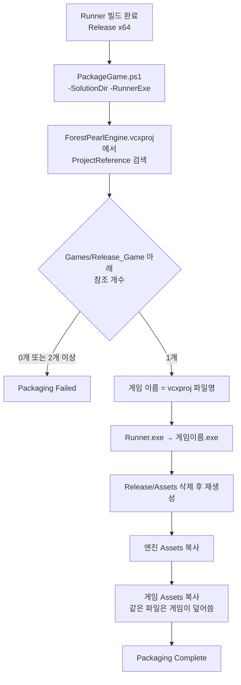

에셋 복사 규칙:

- `Shader` 폴더를 제외한 모든 항목을 그대로 복사합니다.
- 셰이더는 `Shader/bin/*`만 `Assets/Shader/`로 복사합니다 (`bin` 폴더와 HLSL 소스는 포함되지 않음).

```text
x64/Release/
├── Tri_World.exe
└── Assets/
    ├── Font/
    ├── Level/
    ├── Model/
    ├── Shader/        DefaultVertexShader.vso, DefaultPixelShader.pso
    └── StaticMesh/
```

### 실행할 게임 바꾸기

1. 게임 프로젝트를 `Games/Release_Game/<이름>/`에 두고 솔루션에 추가합니다.
2. `ForestPearlEngine` 프로젝트의 **참조**를 해당 게임 프로젝트 하나로 교체합니다.
3. 게임의 `RegistProjectName()`에서 `FPPathManager::Get().Initialize("<이름>")`을 폴더 이름과 같게 지정합니다.

> `Runners/Runner/ReleaseGameProject.props`에는 `GameProjectName`, `GameAssetDir` 매크로가 정의되어 있으나, 현재 패키징은 이 파일이 아니라 엔진 프로젝트의 참조를 기준으로 동작합니다.

---

## 📝 콘텐츠 프로그래머 가이드

`Games/Release_Game/Tri_World`를 기준으로 게임을 만드는 순서입니다.

### 0. 프로젝트 만들기

- [Visual Studio 설정](#visual-studio-설정)의 ② 게임 프로젝트 속성, ③ 솔루션 연결을 따라 프로젝트를 만듭니다 ([프로젝트 템플릿](#프로젝트-템플릿) 사용 가능).
- 구성 형식 **정적 라이브러리**, C++17, 유니코드, 추가 포함 디렉터리 `$(SolutionDir)Engine`
- 엔진 헤더는 `#include "ForestPearlEngine/..."` 형태로 포함합니다.
- [실행할 게임 바꾸기](#실행할-게임-바꾸기) 절차로 엔진에 연결합니다.

### 1. GameProjectLoader.cpp — 엔진 Hook 구현

엔진이 부팅 중 호출하는 함수 5개를 구현합니다.

| 함수 | 호출 시점 | 할 일 |
|---|---|---|
| `RegistProjectName()` | 윈도우 생성 전 | 프로젝트 이름, 창 크기 |
| `LoadLevel()` | 렌더러 초기화 후 | Level JSON 등록 |
| `LoadClassRegist()` | `LoadLevel` 다음 | 클래스 등록 |
| `LoadAssets()` | `LoadClassRegist` 다음 | FBX, StaticMesh, Shader 로드 |
| `ReturnStartLevel()` | `Initialize()` | 시작 레벨 이름 반환 |

```cpp
#include "ForestPearlEngine/GameProjectLoader.h"
#include "GameMode.h"
#include "GameController.h"
#include "Player.h"
// ...

void RegistProjectName()
{
    FPPathManager::Get().Initialize("Tri_World");          // 폴더 이름과 동일

    FPGameProjectSetting* Setting =
        static_cast<FPGameProjectSetting*>(FPGameInstance::Get().GetGameProjectSetting());
    Setting->SetWinWidth(960);
    Setting->SetWinHeight(600);
    Setting->ProjectSetting();                             // 창 제목 = 프로젝트 이름
}

void LoadLevel()
{
    FPAssetLoader* Loader = static_cast<FPAssetLoader*>(FPGameInstance::Get().GetAssetLoader());
    Loader->LoadLevelData("TriWorld", "TriWorld.json", AssetOwner::User);
}

void LoadClassRegist()
{
    FPGameProjectClassRegistry* Registry =
        static_cast<FPGameProjectClassRegistry*>(FPGameInstance::Get().GetClassRegister());

    Registry->Register<GameMode>("GameMode");
    Registry->Register<GameController>("GameController");
    Registry->Register<Player>("Player");
    // Level JSON · GameMode · StaticMesh JSON에서 이름으로 쓰는 모든 클래스
}

void LoadAssets()
{
    FPAssetLoader* Loader = static_cast<FPAssetLoader*>(FPGameInstance::Get().GetAssetLoader());

    Loader->LoadFbxData("Windmill/Windmill_Body.fbx", AssetOwner::User);               // ① FBX
    Loader->LoadStaticMesh("Windmill_Body_StaticMesh",
                           "Windmill_Body_StaticMesh.json", AssetOwner::User);         // ② StaticMesh
}

std::string ReturnStartLevel() { return "TriWorld"; }
```

#### 클래스 등록 규칙

> [!WARNING]
> **등록 이름은 반드시 등록하는 C++ 클래스 이름과 같아야 합니다** (대소문자 포함).
>
> ```cpp
> Registry->Register<Player>("Player");   // ✔ 클래스 이름 = 등록 이름
> Registry->Register<Player>("Hero");     // ✘ 이름이 다름
> Registry->Register<Windmill>("Player"); // ✘ 다른 클래스의 이름
> ```

레지스트리는 문자열과 타입이 일치하는지 검사하지 않습니다. 등록 이름은 데이터와 코드가 클래스를 가리키는 유일한 수단이며, 아래 모든 곳에서 **클래스 이름**으로 사용됩니다.

| 이름을 사용하는 곳 | 예 |
|---|---|
| Level JSON `gamemode` | `"gamemode": "GameMode"` |
| Level JSON `actors[].class` | `"class": "Tree"` |
| `FPAGameMode::ControllerList` | `ControllerList.push_back("GameController")` |
| StaticMesh JSON `Material` | `"Material": "CB2Material"` |
| `FPGameplayStatics` | `GetActorOfClass(GetWorld(), "Player")` → 결과를 `static_cast<Player*>`로 사용 |
| `FPWorld::SpawnActor` | `SpawnActor("Tree", "RuntimeTree")` |

| 잘못된 등록 | 결과 |
|---|---|
| 사용하는 이름이 등록되어 있지 않음 | Level 로드 · Controller 생성 · `SpawnActor`에서 `nullptr` 역참조로 종료. GameMode는 콘솔에 `…의 Class가 존재하지 않음`을 출력한 뒤 World 초기화에서 종료. `GetActorOfClass`는 `std::bad_typeid` 예외 |
| 다른 클래스의 이름으로 등록 | 엉뚱한 클래스가 생성되고, 이름을 믿고 `static_cast`한 코드가 잘못된 타입을 다룸 |
| 같은 이름으로 두 번 등록 | 경고 없이 나중 등록이 앞의 것을 덮어씀 |
| Material 이름이 등록되어 있지 않음 | 기본 `FPMaterial` 사용 (오류 없음) |

그 밖의 조건:

- 등록하는 클래스는 `FPObject`를 상속하고 **기본 생성자**가 있어야 합니다.
- Level JSON · GameMode · StaticMesh JSON · `FPGameplayStatics`에서 이름으로 쓰는 클래스는 **모두** 등록해야 합니다.

### 2. GameMode — 사용할 Controller 지정

```cpp
class GameMode : public FPAGameMode { /* Initialize / BeginPlay / Tick override */ };

void GameMode::Initialize()
{
    ControllerList.push_back("GameController");   // 0번 = Player Controller
    __super::Initialize();                        // 여기서 Controller가 생성됨
}
```

### 3. Controller — 키 매핑과 전역 입력

```cpp
void GameController::Initialize()
{
    // ① 매핑: Input Action 이름, 키, Modifier
    GetInputComponent().AddMappingKey("IA_SetMoveTriangel", 'W', { ESwizzle::YZX, ENegative::Positive });
    GetInputComponent().AddMappingKey("IA_SetMoveTriangel", 'S', { ESwizzle::YZX, ENegative::Negative });
    GetInputComponent().AddMappingKey("IA_SetMoveTriangel", 'A', { ESwizzle::XYZ, ENegative::Negative });
    GetInputComponent().AddMappingKey("IA_SetMoveTriangel", 'D', { ESwizzle::XYZ, ENegative::Positive });
    GetInputComponent().AddMappingKey("IA_SetMoveTriangel",
        static_cast<USHORT>(XBOX_GAMEPAD::GAMEPAD_LSTICK), { ESwizzle::XYZ, ENegative::Positive });

    // ② 바인딩: Controller 자신에게 바인딩한 함수는 Possess 대상과 무관하게 호출됨
    GetInputComponent().BindMethod("IA_NextActor", this, EKeyState::Down, &GameController::NextPawn);

    __super::Initialize();
}

void GameController::NextPawn(FInputValue Value)
{
    ControllPawnIndex = (ControllPawnIndex + 1) % ControllPawnSize;
    Possess(ControllPawn[ControllPawnIndex]);
}
```

### 4. Actor / Pawn — 컴포넌트 조립

| 베이스 | 용도 | Tri_World 예 |
|---|---|---|
| `FPActor` | 배치만 하는 오브젝트 | `Terrain`, `Tree`, `Grid`, `Axis`, `UI` |
| `FPPawn` | Possess 대상 | `Player`, `Windmill`, `WindmillWing`, `TripleWindmillWing`, `TripleWingWindmill` |

```cpp
void Player::Initialize()
{
    // 메시를 Root로
    Mesh = new FPStaticMeshComponent(this, "ToonLinkTriangle_StaticMesh");
    SetRootComponent(Mesh);

    // 자식 컴포넌트
    ShieldPivot = new FPSceneComponent(this);
    ShieldPivot->SetupAttachment(Mesh);
    ShieldPivot->SetRelativeLocation({ 0.0f, 2.0f, 0.0f });

    // 3인칭 카메라
    SpringArm = new FPSpringArmComponent(this);
    SpringArm->SetupAttachment(RootComponent);
    SpringArm->TargetArmLength = 50.0f;
    SpringArm->SetRelativeRotation({ 30.0f, 0.0f, 0.0f });
    SpringArm->bUsePawnControlRotation = true;

    PlayerCamera = new FPCameraComponent(this);
    PlayerCamera->SetupAttachment(SpringArm);

    // 입력 바인딩 + Possess
    FPAController* Controller = GetWorld()->GetController(0);
    Controller->GetInputComponent().BindMethod("IA_SetMoveTriangel", this, EKeyState::Pressed, &Player::Move);
    Controller->Possess(this);
}

void Player::Move(FInputValue Value)
{
    float Delta = GetWorld()->GetGameTimer()->DeltaTime();
    RootComponent->AddWorldOffset({ Value.X * 10.0f * Delta, 0.0f, Value.Y * 10.0f * Delta });
}

void Player::Tick()
{
    // ... 로직
    __super::Tick();   // 필수: 컴포넌트 트랜스폼 갱신
}
```

**생명주기**

| 함수 | 시점 | 권장 작업 |
|---|---|---|
| `Initialize()` | 레벨의 모든 액터가 생성된 뒤 | 컴포넌트 생성, 입력 바인딩 |
| `BeginPlay()` | 모든 액터의 `Initialize()` 이후 | 다른 액터 검색, Attach |
| `Tick()` | 매 프레임 | 로직 후 `__super::Tick()` |

> [!CAUTION]
> 소멸 처리는 아직 구성되지 않았습니다. 액터와 컴포넌트를 런타임에 `delete`하지 말고 `SetActive(false)`로 숨기세요.
> 자세한 내용은 [알려진 문제 — 소멸 처리](#-알려진-문제--소멸-처리)를 참고하세요.

### 5. 컴포넌트 레퍼런스

#### `FPSceneComponent` — 트랜스폼 계층

| 분류 | 함수 |
|---|---|
| 부착 | `SetupAttachment(Parent, SocketName = "")`, `DetachFromComponent()`, `GetAttachmentRoot()` |
| 설정 (부모 기준) | `SetRelativeLocation`, `SetRelativeRotation`, `SetRelativeScale3D` |
| 설정 (월드 기준) | `SetWorldLocation`, `SetWorldRotation`, `SetWorldScale3D` |
| 증분 | `AddLocalOffset`, `AddLocalRotation`(자신의 축 기준 회전), `AddRelativeLocation`, `AddRelativeRotation`(부모 축 기준 회전), `AddWorldOffset`, `AddWorldRotation` |
| 조회 | `GetComponentTransform / Location / Rotation / Quat / Scale`, `GetRelativeTransform / Location / Rotation / Scale3D`, `GetSocketTransform(name)` |

월드 변환은 `Scale = 부모 × 로컬`, `Rotation = 부모 사원수 × 로컬 사원수`, `Location = 부모 위치 + Rotate(부모 회전, 로컬 위치 × 부모 스케일)`로 계산합니다. Socket에 붙은 경우 부모 대신 Socket의 월드 Transform을 사용합니다.

#### `FPStaticMeshComponent` — 메시 렌더링

```cpp
auto* Body = new FPStaticMeshComponent(this, "Windmill_Body_StaticMesh");  // LoadStaticMesh 이름
```

| 함수 | 설명 |
|---|---|
| `SetActive(bool)` | 렌더링 On/Off. `false`면 Render List 생성 단계에서 제외됨 |
| `SetPriority(int)` | 값이 **작은** 항목부터 그려짐 |
| `SetMaterial(FPMaterialInterface*)` | Material 교체 ([상수 버퍼 운용 시 유의사항](#8-커스텀-material과-상수-버퍼)) |
| `SetStaticMesh(name)` | 메시 교체. 현재는 이전 메시의 렌더 항목이 남아 함께 그려짐 ([알려진 문제](#-알려진-문제--소멸-처리)) |
| `GetSocketTransform(name)` | Socket의 월드 Transform |

> Fill(Solid / Wireframe) · Cull(뒷면 제거)은 컴포넌트별이 아니라 렌더러 전역 설정입니다.
> `ForestPearlEngine::GetGameEngine().SetbFill(bool)` / `SetbCull(bool)`로 바꾸며, `MeshRenderPass`와 `GizmoRenderPass`에 모두 적용됩니다.

#### `FPCameraComponent` — 카메라

| 멤버 | 기본값 | 설명 |
|---|---|---|
| `Fov` | 45° | 시야각 |
| `Aspect` | 960 / 600 | 화면비 |
| `Zn` / `Zf` | 1 / 100 | 근/원 평면 |
| `Active` | `true` | 사용 여부 |
| `OnTripleCam()` | — | 3분할 뷰포트 토글 |

컴포넌트의 월드 위치·회전으로 View 행렬을 만들기 때문에, SpringArm이나 다른 컴포넌트에 붙이는 것만으로 카메라가 움직입니다.

#### `FPSpringArmComponent` — 스프링 암

| 멤버 | 설명 |
|---|---|
| `TargetArmLength` | 자식(카메라)이 놓이는 거리. 암의 전방(+Z) 반대 방향 |
| `bUsePawnControlRotation` | `true`면 부모 회전 대신 **Controller의 회전**을 사용 |

Pawn에서 `AddControllerYawInput(v)`, `AddControllerPitchInput(v)`를 호출하면 카메라가 회전합니다.

#### `GizmoGridComponent` · `GizmoAxisComponent` — Grid / Axis

```cpp
// Grid::Initialize()
GridComponent = new GizmoGridComponent(this, "Grid");        // 두 번째 인자 = 기즈모 메시 이름 (VertexBuffer 키, 기즈모마다 고유하게)
SetRootComponent((FPSceneComponent*)GridComponent);

// Axis::Initialize()
AxisComponent = new GizmoAxisComponent(this, "Axis");        // X 빨강 / Y 초록 / Z 파랑
SetRootComponent((FPSceneComponent*)AxisComponent);
```

생성자가 기본값(`GIZMO_GRIDINFO` / `GIZMO_AXISINFO`)으로 라인 메시를 만들어 `FPGizmoRenderList`에 등록합니다.
기즈모는 `GizmoRenderPass`에서 `LINELIST`로 그려지며, 메시와 같은 Material · 상수 버퍼 규칙을 따릅니다. `SetActive`, `SetPriority`를 제공합니다.

#### `FPTextComponent` — 화면 텍스트

```cpp
FPTextComponent* Text = new FPTextComponent();
Text->SetTextData(&bShow, 10, 10, { 1.0f, 1.0f, 0.0f, 1.0f }, _T("Hello"));
//                 ↑ 표시 여부 bool의 주소 (여러 텍스트가 하나의 플래그를 공유 가능)
```

좌표는 클라이언트 영역 픽셀, 색은 RGBA(0~1)입니다. 내용이 바뀌면 `SetTextData`를 다시 호출합니다.

#### `FPInputComponent` — 입력

Controller가 소유합니다. `GetWorld()->GetController(0)->GetInputComponent()`로 접근하며 `AddMappingKey`, `BindMethod`를 제공합니다 ([Input 시스템](#-input-시스템) 참고).

#### `FPMovementComponent`

`UpdatedComponent`를 가지는 골격만 정의되어 있습니다.

### 6. Socket과 Attach

```cpp
// 액터를 다른 액터의 Root 메시 Socket에 부착
AttachToActor(Body, "WingPoint1");

// 액터를 특정 컴포넌트에 부착
AttachToComponent(ShieldPivot);

// 컴포넌트를 Socket에 부착
Wing1->SetupAttachment(Body, "UpScaleWingPoint1");

// 분리
DetachFromActor();
```

- Socket은 StaticMesh JSON의 `Sockets`에 정의합니다.
- Socket 이름이 없거나 찾을 수 없으면 부모 컴포넌트의 Transform에 붙습니다.
- Attach 후 `SetRelative*`로 Socket 기준 오프셋을 조정합니다.

### 7. 유틸리티

```cpp
// 액터 검색 (ClassRegistry에 등록한 이름)
FPActor* P = FPGameplayStatics::GetActorOfClass(GetWorld(), "Player");

std::vector<FPActor*> Windmills;
FPGameplayStatics::GetAllActorsOfClass(GetWorld(), "Windmill", Windmills);

// 시간
float Delta = GetWorld()->GetGameTimer()->DeltaTime();

// 런타임 스폰 (Initialize → BeginPlay 즉시 호출)
FPActor* NewTree = GetWorld()->SpawnActor("Tree", "RuntimeTree");

// 엔진 기능
ForestPearlEngine::GetGameEngine().SetZEnable(false);              // 깊이 테스트
ForestPearlEngine::GetGameEngine().GetAdapterDescription(0);       // GPU 이름
ForestPearlEngine::GetGameEngine().StopEngine();                   // 종료
```

### 8. 커스텀 Material과 상수 버퍼

셰이더에 게임 데이터(색, 시간, 비율 등)를 넘기려면 `FPMaterial`을 상속해 **상수 버퍼를 등록**합니다.
슬롯 번호와 레지스터의 대응은 [상수 버퍼 슬롯 규약](#슬롯-규약)을 따릅니다.

#### 작성 순서

```cpp
#include "ForestPearlEngine/FPMaterial.h"
#include <cmath>

class PulseMaterial : public FPMaterial
{
    // ① 상수 버퍼용 구조체: 16 byte 배수, 멤버 순서 = HLSL cbuffer 선언 순서
    struct alignas(16) VSParams { float Scale; float Pad[3]; };         // 16 byte  → VS 등록 슬롯 0 = b2
    struct alignas(16) PSParams { float R, G, B, A; };                  // 16 byte  → PS 등록 슬롯 0 = b1

    VSParams VSData{ 1.0f, {} };
    PSParams PSData{ 1.0f, 1.0f, 0.0f, 1.0f };
    float    Time = 0.0f;

public:
    PulseMaterial()
    {
        // ② 생성자에서 등록. 등록 순서가 곧 인덱스이므로 0번부터 빈틈없이
        FPConstantBufferRenderDataUtil::AddConstantBuffer(VertexConstantBuffer, 0, VSData);
        FPConstantBufferRenderDataUtil::AddConstantBuffer(PixelConstantBuffer,  0, PSData);
    }

    void UpdateMaterial(float DeltaTime) override
    {
        Time += DeltaTime;
        VSData.Scale = 1.0f + 0.2f * sinf(Time);
        PSData.G     = 0.5f + 0.5f * sinf(Time);

        // ③ 멤버만 바꿔서는 반영되지 않음. 바뀐 값을 다시 복사해 넣어야 함
        FPConstantBufferRenderDataUtil::UpdateConstantBuffer(VertexConstantBuffer, 0, VSData);
        FPConstantBufferRenderDataUtil::UpdateConstantBuffer(PixelConstantBuffer,  0, PSData);
    }
};
```

```hlsl
// Pulse.vsh — Object(b0)는 기본 셰이더와 같은 순서로 선언
cbuffer ObejctConstBuffer : register(b0) { matrix mWorld; matrix mView; matrix mProj; matrix mWV; matrix mWVP; };
cbuffer PulseVS           : register(b2) { float gScale; float3 _pad; };   // VS Material 슬롯 0

// Pulse.psh
cbuffer PulsePS           : register(b1) { float4 gColor; };               // PS Material 슬롯 0
```

```cpp
// 사용: 셰이더는 LoadAssets()에서 미리 로드해 둔다
PulseMat = new PulseMaterial();
PulseMat->SetVertexShader("Pulse.vso");
PulseMat->SetPixelShader("Pulse.pso");
Mesh->SetMaterial(PulseMat);               // 메시 컴포넌트를 만든 직후에 호출 ([알려진 문제] 참고)

void MyActor::Tick()
{
    PulseMat->UpdateMaterial(GetWorld()->GetGameTimer()->DeltaTime());   // 엔진이 자동 호출하지 않음
    __super::Tick();
}
```

StaticMesh JSON의 `"Material"`로 지정하려면 `Registry->Register<PulseMaterial>("PulseMaterial")`로 등록합니다 ([클래스 등록 규칙](#클래스-등록-규칙)).

#### ⚠️ 상수 버퍼 운용 시 유의사항

> [!IMPORTANT]
> 상수 버퍼는 **컴파일러와 런타임이 거의 검사해 주지 않는 영역**입니다. 규칙을 어기면 오류 메시지 없이 색이 이상하거나, 다른 Material 값이 섞이거나, 메모리가 손상됩니다.

**① 크기 · 레이아웃**

| 규칙 | 이유 / 어기면 |
|---|---|
| **구조체 1개의 크기는 320 byte 이하** | 슬롯의 GPU 버퍼가 320 byte 고정입니다. 크기 검사가 없어 더 큰 구조체는 `Map`된 메모리를 넘어 `memcpy`합니다 (메모리 손상). 큰 데이터는 구조체를 나눠 슬롯 여러 개로 등록하세요 |
| **구조체에 `alignas(16)`을 붙이고 크기를 16 byte 배수로** | HLSL `cbuffer`는 16 byte 단위로 패킹됩니다. 모자라는 부분은 `float Pad[n]`으로 명시해 두면 C++ · HLSL 레이아웃을 맞추기 쉽습니다 |
| **멤버 순서 · 타입을 HLSL `cbuffer`와 완전히 일치** | 컴파일러가 둘을 대조하지 않습니다. 순서가 다르면 값이 엉뚱한 변수로 들어갑니다 |
| **하나의 `float4`(16 byte) 경계를 넘는 멤버를 두지 않는다** | `float3` 뒤에는 `float`이 같은 16 byte 안으로 들어가고, `float2` 다음 `float3`은 다음 16 byte로 넘어갑니다. 헷갈리면 모두 `float4` 단위로 설계하세요 |
| **`bool`을 쓰지 않는다. `float` / `int` / `uint`를 사용** | C++ `bool`은 1 byte, HLSL `bool`은 4 byte입니다 |
| **배열은 요소마다 16 byte** | HLSL `float arr[4]`는 16 × 4 = 64 byte로 패킹됩니다. 배열이 필요하면 `float4` 배열로 선언하세요 |
| **`std::string` · `std::vector` · 포인터 · 가상 함수가 있는 타입은 담지 않는다** | `memcpy`로 복사되므로 `std::is_trivially_copyable`이어야 합니다. 어기면 컴파일 단계에서 `static_assert`로 막히거나, 포인터를 넣으면 주소값이 GPU로 갑니다 |

**② 슬롯 · 등록**

| 규칙 | 이유 / 어기면 |
|---|---|
| **Material 슬롯 `k`는 VS `b(2+k)`, PS `b(1+k)`** | `register(b#)`를 이 표대로 선언해야 합니다. VS의 `b0`(Object), `b1`(ViewPort)은 엔진 예약이라 **Material이 쓸 수 없습니다.** PS `b0`도 ViewPort 예약입니다 |
| **슬롯은 VS 최대 `k = 11`, PS 최대 `k = 12`** | 상수 버퍼는 `b13`까지입니다. 범위를 검사하지 않아 넘어가면 배열 범위 밖 접근으로 종료됩니다 |
| **`AddConstantBuffer`는 0번부터 순서대로, 빈틈 · 중복 없이** | `UpdateConstantBuffer`의 두 번째 인자는 셰이더 슬롯이 아니라 **등록 순서 인덱스**입니다. 번호를 건너뛰거나 순서가 달라지면 엉뚱한 항목을 덮어씁니다 |
| **VS와 PS는 각각 등록한다** | VS `b2`와 PS `b2`는 서로 다른 버퍼입니다. 같은 값을 양쪽에서 쓰려면 `VertexConstantBuffer`와 `PixelConstantBuffer`에 따로 등록하세요 |
| **셰이더가 선언한 `cbuffer` 수 = Material이 등록한 수** | 28개 버퍼는 **모든 오브젝트가 돌려 씁니다.** Material이 등록하지 않은 슬롯을 셰이더가 읽으면 *직전에 그려진 다른 Material의 값*(처음에는 0 / 쓰레기)이 보입니다 |
| **기본 셰이더(`Default*.vso/.pso`)를 쓰면 등록하지 않는다** | 기본 셰이더는 `b0`만 사용합니다 |
| **뷰포트 상수 버퍼(`b1`)를 다른 용도로 선언하지 않는다** | VS `b1`에는 매 뷰포트마다 엔진이 `VertexConst { AniOn, BlendOn }`을 씁니다 |

**③ 값 갱신**

| 규칙 | 이유 / 어기면 |
|---|---|
| **구조체를 바꾼 뒤 `UpdateConstantBuffer`를 호출** | `Add` / `Update`는 호출 시점의 값을 **복사**합니다. 구조체 멤버만 수정하면 셰이더는 등록 당시의 값을 계속 봅니다 |
| **`Update`에는 `Add`와 같은 타입을 넘긴다** | 크기 일치 검사(`assert`)는 **Debug에서만** 동작합니다. Release에서는 다른 크기를 조용히 복사합니다 |
| **구조체는 값(또는 참조)으로 넘기고, 포인터를 넘기지 않는다** | `Add(…, 0, ptr)`처럼 포인터를 넘기면 `T`가 포인터 타입으로 추론되어 **포인터 값 8 byte가 복사**됩니다 (오류 없이 컴파일됨). 항상 `Add(…, 0, *ptr)` 또는 값 변수를 넘기세요 |
| **`UpdateMaterial()`을 `Tick()`에서 직접 호출** | 엔진은 호출하지 않습니다. Render List는 `Tick`이 끝난 뒤 복사되므로 `Tick` 안에서 갱신하면 같은 프레임에 반영됩니다 |
| **값이 바뀌지 않으면 `Update`를 생략한다** | 등록해 둔 값은 유지됩니다. `Update`는 `memcpy`만 하지만, 상수 버퍼 데이터는 프레임마다 Render List로 통째로 복사되고 GPU 쓰기(`Map`)는 *오브젝트 × 카메라*마다 일어나므로 작게 유지하는 편이 좋습니다 |

**④ 소유 · 수명**

| 규칙 | 이유 / 어기면 |
|---|---|
| **상수 버퍼 데이터는 Material 인스턴스가 소유한다** | 같은 Material 포인터를 공유하는 메시는 값도 공유합니다. 메시마다 다른 값이 필요하면 Material을 `new`로 각각 만드세요 |
| **Material을 `delete`하지 않는다** | 렌더 항목이 Material의 상수 버퍼 데이터 **주소**를 들고 있어 Dangling이 됩니다 ([알려진 문제](#-알려진-문제--소멸-처리)) |
| **`SetMaterial()`은 메시 컴포넌트를 만든 직후에 호출** | 렌더 항목 포인터가 무효화될 수 있습니다 ([사용 규칙](#4-현재-버전에서-지켜야-할-사용-규칙)) |
| **`b0`의 행렬은 `mul(mWVP, pos)` 순서로 사용** | CPU 행렬이 전치 없이 전달됩니다. 직접 행렬을 상수 버퍼로 넘길 때도 같은 규칙을 따르세요 |

**⑤ 체크리스트**

- [ ] 구조체가 `alignas(16)`이고 `sizeof`가 16의 배수이며 320 이하인가?
- [ ] 멤버 순서 · 타입이 HLSL `cbuffer`와 같은가? (`bool`, 배열, `float3` 패킹 확인)
- [ ] `AddConstantBuffer`를 0번부터 빈틈없이 등록했고, `register(b#)`가 VS `b(2+k)` / PS `b(1+k)`와 맞는가?
- [ ] 셰이더가 선언한 `cbuffer`를 전부 Material이 등록했는가?
- [ ] 값을 바꾼 뒤 `UpdateConstantBuffer`를 호출하고, 그 호출이 `Tick()`에서 일어나는가?
- [ ] 포인터가 아니라 구조체를 `Add` / `Update`에 넘겼는가?
- [ ] 메시마다 값이 달라야 한다면 Material 인스턴스를 따로 만들었는가?

> [!NOTE]
> `Games/Release_Game/ShaderCode_Triangle`의 `CB2Material` 등 기존 샘플은 이전 방식(`VertextConst = 포인터`)과 이전 슬롯 규약(PS `b0`)을 사용하므로 **현재 엔진에서 그대로 빌드 · 동작하지 않습니다.** 위 방식으로 옮겨서 사용하세요.

---

## 🎬 Demo 프로젝트 — Tri_World

> 위치: [`Games/Release_Game/Tri_World`](Games/Release_Game/Tri_World)

SpringArm 카메라, Possess 전환, Socket 부착, 계층 트랜스폼을 한 장면에서 확인하는 데모입니다.

### 실행

| 방법 | 절차 |
|---|---|
| 패키지 실행 | `Release\|x64` 빌드 → `x64/Release/Tri_World.exe` |
| 디버그 실행 | `Debug\|x64`, 시작 프로젝트 **Runner** → F5 |

### 씬 구성 (`Assets/Level/TriWorld.json`, 액터 310개)

| 클래스 | 수 | 베이스 | 구성 | 설명 |
|---|:-:|---|---|---|
| `Terrain` | 1 | `FPActor` | StaticMesh | 128×128 지형 |
| `Tree` | 300 | `FPActor` | StaticMesh | 나무 |
| `Grid` | 1 | `FPActor` | Gizmo | 128×128 그리드 |
| `Axis` | 1 | `FPActor` | Gizmo | 월드 축 |
| `UI` | 1 | `FPActor` | Text × 19 | FPS, 도움말, GPU / 해상도 / 렌더 상태 |
| `Player` | 1 | `FPPawn` | StaticMesh + ShieldPivot + SpringArm + Camera | 시작 시 Possess. 제자리에서 계속 회전 |
| `Windmill` | 2 | `FPPawn` | StaticMesh (몸체) | 이동 / 회전 / 크기 조절 |
| `WindmillWing` | 1 | `FPPawn` | StaticMesh (날개) | `Windmill`의 `WingPoint1` Socket에 부착. Player에게 옮겨 붙일 수 있음 |
| `TripleWindmillWing` | 1 | `FPPawn` | StaticMesh × 3 | 날개 → 날개 → 날개로 이어지는 3단 Socket 체인. `Windmill2`의 `TripleWingPoint`에 부착 |
| `TripleWingWindmill` | 1 | `FPPawn` | StaticMesh × 4 | 몸체 + `UpScaleWingPoint1~3` Socket에 크기·속도가 다른 날개 3개 |

**Socket 정의**

| StaticMesh | Socket |
|---|---|
| `Windmill_Body_StaticMesh` | `WingPoint1`, `UpScaleWingPoint1`, `UpScaleWingPoint2`, `UpScaleWingPoint3`, `TripleWingPoint` |
| `Windmill_Wing_StaticMesh` | `WingPoint1` |
| `ToonLink_StaticMesh`, `ToonLinkTriangle_StaticMesh` | `ShieldPivot`, `HeadPivot` |

### 조작법

조작 대상은 **현재 Possess 중인 Pawn**입니다. Possess 순서는 `Player → Windmill → Windmill2 → TripleWingWindmill`이며 시작 대상은 `Player`입니다.

#### ⌨️ 키보드 · 마우스

| 키 | 동작 | 대상 |
|:-:|---|---|
| <kbd>W</kbd> <kbd>A</kbd> <kbd>S</kbd> <kbd>D</kbd> | 이동 (전 / 좌 / 후 / 우) | Possess 중인 Pawn |
| <kbd>I</kbd> <kbd>K</kbd> | 카메라 Pitch 회전 | Player |
| <kbd>J</kbd> <kbd>L</kbd> | 카메라 Yaw 회전 | Player |
| <kbd>Q</kbd> <kbd>E</kbd> | Y축 회전 (+ / −) | Windmill, TripleWingWindmill |
| <kbd>R</kbd> <kbd>F</kbd> | 크기 확대 / 축소 | Windmill, TripleWingWindmill |
| <kbd>.</kbd> <kbd>,</kbd> | 날개 크기 확대 / 축소 | Player, Windmill |
| <kbd>Z</kbd> | 날개를 Player 머리(`HeadPivot`)에 부착 / 풍차로 복귀 | Player |
| <kbd>X</kbd> | 날개를 Player 주위를 도는 쉴드(`ShieldPivot`)로 부착 / 풍차로 복귀 | Player |
| <kbd>Space</kbd> | 채우기 전환 (Solid ↔ Wireframe) | 전체 |
| <kbd>F1</kbd> | 도움말 UI 표시 전환 | 전체 |
| <kbd>F2</kbd> | Grid 표시 전환 | 전체 |
| <kbd>F3</kbd> | Axis 표시 전환 | 전체 |
| <kbd>F4</kbd> | 뒷면 제거 전환 | 전체 |
| <kbd>F5</kbd> | 깊이 테스트 전환 | 전체 |
| <kbd>↑</kbd> <kbd>↓</kbd> <kbd>←</kbd> <kbd>→</kbd> | `IA_SetMoveWindmill`에 매핑만 되어 있음 (바인딩된 동작 없음) | — |

- **마우스** — 엔진은 좌 / 우 / 휠 버튼 입력을 수집하지만, Tri_World에는 마우스에 매핑된 조작이 없습니다.
- **Possess 전환** — 키보드에는 매핑되어 있지 않습니다. 게임패드 D-Pad를 사용합니다.

#### 🎮 게임패드 (Xbox / XInput)

| 입력 | 동작 | 대상 |
|:-:|---|---|
| **L-Stick** | 이동 | Possess 중인 Pawn |
| **R-Stick** | 카메라 회전 (좌우 Yaw / 상하 Pitch) | Player |
| **D-Pad →** | 다음 Pawn으로 Possess 전환 | 전체 |
| **D-Pad ←** | 이전 Pawn으로 Possess 전환 | 전체 |
| **L-Stick 클릭** / **R-Stick 클릭** | Y축 회전 (− / +) | Windmill, TripleWingWindmill |
| **LT** / **RT** | 크기 축소 / 확대 (누른 정도에 비례) | Windmill, TripleWingWindmill |
| **LB** / **RB** | 날개 크기 축소 / 확대 | Player, Windmill |
| **A** | 날개를 Player 머리에 부착 / 복귀 | Player |
| **B** | 날개를 Player 쉴드로 부착 / 복귀 | Player |

<details>
<summary><b>Input Action 매핑 전체 (GameController.cpp)</b></summary>

| Input Action | 키보드 | 게임패드 | 호출 조건 | 바인딩 |
|---|---|---|:-:|---|
| `IA_SetMoveTriangel` | W / A / S / D | L-Stick | Pressed | `Player::Move`, `Windmill::Move`, `TripleWingWindmill::Move` |
| `IA_SetMoveCamera` | I / J / K / L | R-Stick | Pressed | `Player::CameraMove` |
| `IA_SetMoveWindmill` | ↑ / ← / ↓ / → | — | — | 없음 |
| `IA_SetRotateWindmill` | Q(+) / E(−) | R-Stick 클릭(+) / L-Stick 클릭(−) | Pressed | `Windmill::Rotate`, `TripleWingWindmill::Rotate` |
| `IA_SetScaleWindmill` | R(+) / F(−) | RT(+) / LT(−) | Pressed | `Windmill::Scaling`, `TripleWingWindmill::Scaling` |
| `IA_SetScaleWing` | .(+) / ,(−) | RB(+) / LB(−) | Pressed | `Player::SetScaleWing`, `Windmill::SetScaleWing`, `WindmillWing::SetScaleWing`, `TripleWindmillWing::SetScaleWing` |
| `IA_AttachHead` | Z | A | Down | `Player::AttachHead` |
| `IA_AttachShield` | X | B | Down | `Player::AttachShield` |
| `IA_NextActor` | — | D-Pad → | Down | `GameController::NextPawn` |
| `IA_PrevActor` | — | D-Pad ← | Down | `GameController::PrevPawn` |
| `IA_SetFillTriangel` | Space | — | Down | `GameController::SetFillTriangel` |
| `IA_SetCullTriangel` | F4 | — | Down | `GameController::SetCullTriangle` |
| `IA_SetUITriangel` | F1 | — | Down | `GameController::SetActiveViewHelp` |
| `IA_SetGrid` | F2 | — | Down | `GameController::SetGridOn` |
| `IA_SetAxis` | F3 | — | Down | `GameController::SetAxisOn` |
| `IA_SetDepthStencilBuffer` | F5 | — | Down | `GameController::SetActiveDepthStencilBuffer` |

</details>

---

## 🚧 알려진 문제 — 소멸 처리

현재 버전은 객체를 **생성**하는 경로는 갖춰져 있지만 **소멸**하는 경로는 아직 구성되지 않았습니다.
대부분의 소멸자가 `= default`이거나 비어 있고, `new`로 만든 객체를 소유자가 `delete`하지 않습니다.
Tri_World처럼 *레벨 하나를 열어 종료할 때까지 유지*하는 흐름에서는 드러나지 않지만, 아래 상황에서는 문제가 됩니다.

| 상황 | 현재 결과 |
|---|---|
| 프로그램 종료 | SubSystem · GPU 리소스 미해제, D3D Device 계열 이중 Release |
| 레벨 전환 (`OpenLevel` 재호출) | 이전 레벨의 액터가 모두 누수되고, 메시 · 텍스트 · 카메라가 렌더 목록에 남아 계속 사용됨 |
| 런타임에 액터 `delete` | 컴포넌트가 남아 계속 그려지고, 입력 · UI 쪽에 Dangling 포인터 발생 |
| 런타임에 컴포넌트 `delete` | 트랜스폼 계층과 렌더 목록에 Dangling 포인터 발생 |

### 1. 소유한 객체를 해제하지 않는 곳

| 소유자 | 해제되지 않는 대상 | 현재 소멸자 |
|---|---|---|
| `FPGameInstance` | 생성자에서 `new`한 SubSystem 11개 | `= default` |
| `FPWorld` | `GameActorList`의 모든 액터 | `= default`. `Finalize()` / `UnLoadData()`를 직접 호출해야만 삭제됨 |
| `FPGameInstance::OpenLevel` | 이전 World의 액터 전부 | `World.reset()`만 호출하고 `Finalize()`를 호출하지 않음 |
| `FPAGameMode` | `GameController`의 Controller들 | `= default` |
| `FPAController` | `InputComponent` | 비어 있음. `FPInputComponent`의 소멸자는 IMC · Input Action을 해제하지만 호출되지 않음 |
| `FPActor` | 기본 `RootComponent`, 액터가 `new`로 만든 모든 컴포넌트 | `= default`. 액터는 자신이 만든 컴포넌트 목록을 갖고 있지 않음 |
| `FPStaticMeshComponent` | `StaticMesh`(컴포넌트마다 새로 생성되는 `FPStaticMesh`), `Material` | 비어 있음 |
| `FPStaticMesh` | `Material`. 생성자에서 만든 `FPMaterial`이 곧바로 `SetMaterial()`로 덮어써져 즉시 누수 | 없음 |
| `FPMaterial` | `VBLayout`(InputLayout). `SetVertexShader()`를 호출하면 이전 레이아웃도 해제되지 않음 | 없음 |
| `GizmoComponent` | `Material`, 직접 만든 VertexBuffer | 렌더 목록 해제만 수행 |
| `FPViewPortClient` | `FPViewPort` 5개, `VertexConst` 4개 | `= default` |
| `FPAssetManager` | `void*`로 보관하는 VertexBuffer, Shader 객체, Shader 바이트코드 | `= default` |
| `RenderingDevice` | 상수 버퍼 28개(VS 14 · PS 14), DepthStencilState 3개, 열거한 `IDXGIAdapter1`, `IDXGIAdapter4` | 없음 |
| `ForestPearlEngine` | `Renderer` | `Finalize()`만 호출 |
| `FPGameplayStatics::GetActorOfClass` · `GetAllActorsOfClass` | 타입 비교용 임시 인스턴스의 `RootComponent` — **호출할 때마다** 1개 | — |
| `FPWorld::CreateClassInstnce<T>` | `dynamic_cast`가 실패한 객체 (`release()` 후 버려짐) | — |
| 게임 코드 (`UI` 등) | 직접 `new`한 `FPTextComponent` | 없음 |

### 2. 잘못 해제하는 곳

| 위치 | 문제 |
|---|---|
| `RenderingDevice::DeviceFinalize()` | `RenderTargetView`, `SwapChain`, `DeviceContext`, `Device`는 `ComPtr`인데 `->Release()`로 직접 해제함. 종료 시 싱글톤이 소멸하면서 `ComPtr`이 한 번 더 Release → **이중 해제** |
| `FPWorld::UnLoadData()` | 액터를 `delete`한 뒤 `GameActorList`를 비우지 않음. 이후 `Tick()`이 돌거나 다시 호출되면 해제된 메모리 접근 / 이중 `delete` |
| `FPGameInstance::UnLoadData()` + `Finalize()` | `Finalize()`가 내부에서 `UnLoadData()`를 다시 호출하므로 둘 다 호출하면 같은 액터를 두 번 `delete` |
| `FPActor::SetRootComponent()` | 기본 루트를 `delete`함. 이미 자식이 붙어 있거나 다른 컴포넌트에 Attach된 뒤라면 상대 쪽 포인터가 Dangling |
| `FPStaticMeshComponent::SetStaticMesh()` | 이전 `FPStaticMesh`를 해제하지 않고 렌더 항목을 새로 등록함. 이전 항목이 목록에 남아 두 메시가 함께 그려짐 |

### 3. 소멸자를 구현하기 전에 먼저 고쳐야 하는 구조

소멸자를 채우기만 해서는 해결되지 않는 부분입니다.

**렌더 목록이 내준 포인터가 무효화됨**
`FPMeshRenderList` · `FPCameraList` · `FPTextRenderList`는 `std::vector`에 항목을 넣고 `&vector.back()`을 돌려줍니다.
다음 등록에서 재할당이 일어나거나 `erase`로 항목이 당겨지면 컴포넌트가 들고 있는 포인터가 무효가 됩니다.

- `FPMeshComponent` · `FPCameraComponent` · `FPTextComponent` · `GizmoComponent`의 소멸자는 주소 비교로 자기 항목을 찾기 때문에, 찾지 못하거나 다른 컴포넌트의 항목을 지울 수 있습니다.
- `FPMeshComponent::SetMaterial()`은 이 포인터를 통해 값을 다시 쓰므로, 다른 컴포넌트가 등록된 뒤에 호출하면 무효한 메모리에 씁니다.

**`FPSceneComponent`에 소멸자가 없음**
부모의 `ChildComponent`와 자식의 `ParentComponent`에서 자신을 제거하지 않습니다.
다른 액터에 Attach된 경우(예: `WindmillWing` → `Windmill`) 삭제 순서에 따라 Dangling 포인터가 남습니다.

**렌더 항목이 컴포넌트 · 액터 멤버의 주소를 참조함**
`RenderItem`, `CameraItem`, `UIContextItem`은 값이 아니라 주소를 담습니다.
특히 `FPTextComponent`의 `active`는 **액터 멤버 `bool`의 주소**라서, 액터만 삭제되고 텍스트 컴포넌트가 남으면 렌더러가 해제된 메모리를 읽습니다.

**입력 바인딩을 해제할 수단이 없음**
`FBindInfo::BindObj`와 바인딩 람다는 객체의 원시 포인터를 보관하고, 바인딩을 제거하는 API가 없습니다.
`FPPawn`은 소멸할 때 `UnPossess`하지 않으므로 Controller와 `FPInputComponent`의 `PossessedPawn`이 Dangling으로 남습니다.

### 4. 현재 버전에서 지켜야 할 사용 규칙

| 규칙 | 이유 |
|---|---|
| 액터 · 컴포넌트를 런타임에 `delete`하지 않는다. 숨길 때는 `SetActive(false)` | 1, 3번 |
| 한 번의 실행에서 레벨은 하나만 연다 (`OpenLevel`을 다시 호출하지 않는다) | 이전 레벨이 누수되고 렌더 목록에 남음 |
| `FPGameInstance::UnLoadData()`를 직접 호출하지 않는다 | 종료 시 엔진이 `Finalize()`를 호출하므로 이중 `delete` |
| `GetActorOfClass` 계열은 `BeginPlay()`에서 한 번 호출해 멤버에 보관한다. `Tick()`에서 매 프레임 호출하지 않는다 | 호출마다 임시 인스턴스의 컴포넌트가 누수됨 |
| `SetRootComponent()`는 `Initialize()`에서 다른 컴포넌트를 붙이기 전에 가장 먼저 호출한다 | 기본 루트가 `delete`됨 |
| `SetMaterial()`은 메시 컴포넌트를 만든 직후에 호출한다 | 렌더 항목 포인터 무효화 |
| `SetStaticMesh()` · `SetVertexShader()`를 반복 호출하지 않는다 | 이전 리소스가 해제되지 않음 |

---

## 🙏 Credits

| 항목 | 출처 |
|---|---|
| [DirectXTK](https://github.com/microsoft/DirectXTK) | Microsoft — SpriteBatch / SpriteFont |
| [ufbx](https://github.com/ufbx/ufbx) | FBX 로더 |
| [nlohmann/json](https://github.com/nlohmann/json) | JSON 파서 |
| `FPGameTimer` | Frank Luna, *GameTimer* (2011) 기반 |
| Toon Link 모델 | © Nintendo / Sora — The VG Resource (ripped by Mystie). 학습·데모 용도 |

<div align="center">

**ForestPearlEngine** · [teamHUI](https://github.com/teamHUI/ForestPearlEngine)

</div>
